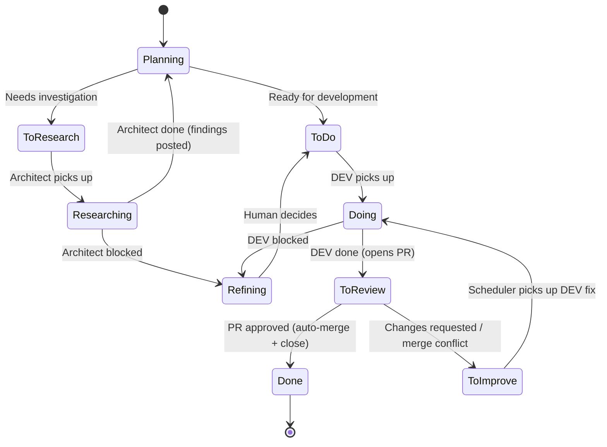

<p align="center">
  
</p>

<p align="center">
  <a href="https://discord.gg/BSEafj4m"></a>
  <a href="https://opensource.org/licenses/MIT"></a>
</p>

# DevClaw — Development Plugin for OpenClaw

**Turn any group chat into a dev team that ships.**

DevClaw is a plugin for [OpenClaw](https://openclaw.ai) that turns your orchestrator agent into a development manager. It hires developers, assigns tasks, reviews code, and keeps the pipeline moving — across as many projects as you have group chats.

**Prerequisites:** [OpenClaw](https://openclaw.ai) must be installed and running.

```bash
openclaw plugins install @laurentenhoor/devclaw
```

Then start onboarding by chatting with your agent in any channel:

```
"Hey, can you help me set up DevClaw?"
```

[Read more on onboarding &rarr;](#getting-started)

---

## What it looks like

You have two projects in two Telegram groups. You go to bed. You wake up:

```
── Group: "Dev - My Webapp" ──────────────────────────────

Agent:  "⚡ Sending DEV (medior) for #42: Add login page"
Agent:  "✅ DEV DONE #42 — Login page with OAuth. PR opened for review."
Agent:  "🔀 PR approved for #42 — auto-merged. Issue closed."
Agent:  "⚡ Sending DEV (junior) for #43: Fix button color on /settings"
Agent:  "✅ DEV DONE #43 — Updated to brand blue. PR opened for review."
Agent:  "🔄 PR changes requested for #43 — Back to DEV."
Agent:  "⚡ Sending DEV (junior) for #43: Fix button color on /settings"

  You:  "Create an issue for refactoring the profile page, pick it up."

Agent:  created #44 "Refactor user profile page" on GitHub — To Do
Agent:  "⚡ Sending DEV (medior) for #44: Refactor user profile page"

Agent:  "✅ DEV DONE #43 — Fixed dark-mode color. PR opened for review."
Agent:  "🔀 PR approved for #43 — auto-merged. Issue closed."

── Group: "Dev - My API" ─────────────────────────────────

Agent:  "🧠 Spawning DEV (senior) for #18: Migrate auth to OAuth2"
Agent:  "✅ DEV DONE #18 — OAuth2 provider with refresh tokens. PR opened for review."
Agent:  "🔀 PR approved for #18 — auto-merged. Issue closed."
Agent:  "⚡ Sending DEV (medior) for #19: Add rate limiting to /api/search"
```

Multiple issues shipped, a PR review round-trip automatically handled, and a second project's migration completed — all while you slept. When you dropped in mid-stream to create an issue, the scheduler kept going before, during, and after.

---

## Why DevClaw

### Autonomous multi-project development

Each project is fully isolated — own queue, workers, sessions, and state. Workers execute in parallel within each project, and multiple projects run simultaneously. A token-free scheduling engine drives it all autonomously:

- **[Scheduling engine](#automatic-scheduling)** — `work_heartbeat` continuously scans queues, dispatches workers, and drives DEV → review → DEV [feedback loops](#how-tasks-flow-between-roles)
- **[Project isolation](#execution-modes)** — parallel workers per project, parallel projects across the system
- **[Role instructions](#custom-instructions-per-project)** — per-project, per-role prompts injected at dispatch time

### Process enforcement

GitHub/GitLab issues are the single source of truth — not an internal database. Every tool call wraps the full operation into deterministic code with rollback on failure:

- **[External task state](#your-issues-stay-in-your-tracker)** — labels, transitions, and status queries go through your issue tracker
- **[Atomic operations](#what-atomic-means-here)** — label transition + state update + session dispatch + audit log in one call
- **[Tool-based guardrails](#the-toolbox)** — 18 tools enforce the process; the agent provides intent, the plugin handles mechanics

### ~60-80% token savings

Three mechanisms compound to cut token usage dramatically versus running one large model with fresh context each time:

- **[Tier selection](#meet-your-team)** — Haiku for typos, Sonnet for features, Opus for architecture (~30-50% on simple tasks)
- **[Session reuse](#sessions-accumulate-context)** — workers accumulate codebase knowledge across tasks (~40-60% per task)
- **[Token-free scheduling](#automatic-scheduling)** — `work_heartbeat` runs on pure CLI calls, zero LLM tokens for orchestration

---

## The problem DevClaw solves

OpenClaw is a great multi-agent runtime. It handles sessions, tools, channels, gateway RPC — everything you need to run AI agents. But it's a general-purpose platform. It has no opinion about how software gets built.

Without DevClaw, your orchestrator agent has to figure out on its own how to:

- Pick the right model for the task complexity
- Create or reuse the right worker session
- Transition issue labels in the right order
- Track which worker is doing what across projects
- Schedule QA after DEV completes, and re-schedule DEV after QA fails
- Detect crashed workers and recover
- Log everything for auditability

That's a lot of reasoning per task. LLMs do it imperfectly — they forget steps, corrupt state, pick the wrong model, lose session references. You end up babysitting the thing you built to avoid babysitting.

DevClaw moves all of that into deterministic plugin code. The agent says "pick up issue #42." The plugin handles the other 10 steps atomically. Every time, the same way, zero reasoning tokens spent on orchestration.

---

## Meet your team

DevClaw doesn't think in model IDs. It thinks in people.

When a task comes in, you don't configure `anthropic/claude-sonnet-4-5` — you assign a **medior developer**. The orchestrator evaluates task complexity and picks the right person for the job:

### Developers

| Level      | Assigns to                                        | Model  |
| ---------- | ------------------------------------------------- | ------ |
| **Junior** | Typos, CSS fixes, renames, single-file changes    | Haiku  |
| **Medior** | Features, bug fixes, multi-file changes           | Sonnet |
| **Senior** | Architecture, migrations, system-wide refactoring | Opus   |

### Reviewers

| Level      | Assigns to                                   | Model  |
| ---------- | -------------------------------------------- | ------ |
| **Junior** | Standard code review, PR inspection          | Sonnet |
| **Senior** | Thorough security review, complex edge cases | Opus   |

### Testers (optional — enable in workflow.yaml)

| Level      | Assigns to                      | Model  |
| ---------- | ------------------------------- | ------ |
| **Junior** | Quick smoke tests, basic checks | Haiku  |
| **Medior** | Standard test validation        | Sonnet |
| **Senior** | Thorough QA, complex edge cases | Opus   |

### Architects

| Level      | Assigns to                     | Model  |
| ---------- | ------------------------------ | ------ |
| **Junior** | Standard design investigation  | Sonnet |
| **Senior** | Complex architecture decisions | Opus   |

A CSS typo gets the intern. A database migration gets the architect. You're not burning Opus tokens on a color change, and you're not sending Haiku to redesign your auth system.

Every mapping is [configurable](docs/CONFIGURATION.md#model-tiers) — swap in any model you want per level.

---

## How a task moves through the pipeline

Every issue follows the same path, no exceptions. DevClaw enforces it:

```
Planning → To Do → Doing → To Review → PR approved → Done (auto-merge + close)
Planning → To Research → Researching → Planning (architect findings)
```



By default, PRs go through **human review** on GitHub/GitLab. The heartbeat polls for approvals and auto-merges. You can switch to agent review or enable an [optional test phase](docs/WORKFLOW.md#test-phase-optional) in `workflow.yaml`.

These labels live on your actual GitHub/GitLab issues. Not in some internal database — in the tool you already use. Filter by `Doing` in GitHub to see what's in progress. Set up a webhook on `Done` to trigger deploys. The issue tracker is the source of truth.

### What "atomic" means here

When you say "pick up #42 for DEV", the plugin does all of this in one operation:

1. Verifies the issue is in the right state
2. Picks the developer level (or uses what you specified)
3. Transitions the label (`To Do` → `Doing`)
4. Creates or reuses the right worker session
5. Dispatches the task with project-specific instructions
6. Updates internal state
7. Logs an audit entry

If step 4 fails, step 3 is rolled back. No half-states, no orphaned labels, no "the issue says Doing but nobody's working on it."

---

## What happens behind the scenes

### Workers report back themselves

When a developer finishes, they call `work_finish` directly — no orchestrator involved:

- **DEV "done"** → label moves to `To Review`, PR goes through human review
- **DEV "blocked"** → label moves back to `To Do`, task returns to queue
- **PR approved** → heartbeat auto-merges, label moves to `Done`, issue closes
- **PR changes requested** → label moves to `To Improve`, scheduler picks up DEV on next tick

With the optional test phase enabled, an additional QA cycle runs before closing:

- **TESTER "pass"** → `Done`, issue closes
- **TESTER "fail"** → `To Improve`, back to DEV

The orchestrator doesn't need to poll, check, or coordinate. Workers are self-reporting.

### Research tasks follow a separate path

Not every task is code. Sometimes you need investigation before implementation — "how should we migrate to OAuth2?", "what's the best caching strategy?", "audit the API for security issues."

The `research_task` tool spawns an architect worker on a separate track:

1. Creates an issue and transitions it to `To Research`
2. Dispatches an architect (junior = Sonnet, senior = Opus) → `Researching`
3. Architect researches and posts findings as issue comments
4. Creates implementation tasks in Planning
5. Completes with `done` (research issue closed) or `blocked` (→ Refining)

No PR, no review cycle — just research → findings → implementation tasks. The architect creates actionable tasks in Planning for you to review and queue.

### Sessions accumulate context

Each developer level gets its own persistent session per project. Your medior dev that's done 5 features on `my-app` already knows the codebase — it doesn't re-read 50K tokens of source code every time it picks up a new task.

That's a **~40-60% token saving per task** from session reuse alone.

Combined with tier selection (not using Opus when Haiku will do) and the token-free heartbeat (more on that next), DevClaw significantly reduces your token bill versus running everything through one large model.

### Everything is logged

Every tool call writes an NDJSON line to `audit.log`:

```bash
cat audit.log | jq 'select(.event=="work_start")'
```

Full trace of every task, every level selection, every label transition, every health fix. No manual logging needed.

---

## Automatic scheduling

DevClaw doesn't wait for you to tell it what to do next. A background scheduling system continuously scans for available work and dispatches workers — zero LLM tokens, pure deterministic code. This is the engine that keeps the pipeline moving: when DEV finishes, the PR goes through review. When review feedback comes back, the scheduler dispatches DEV to fix it. No hand-offs, no orchestrator reasoning — just label-driven scheduling.

### The `work_heartbeat`

Every tick (default: 60 seconds), the scheduler runs two passes:

1. **Health pass** — detects workers stuck for >2 hours, reverts their labels back to queue, deactivates them. Catches crashed sessions, context overflows, or workers that died without reporting back.
2. **Review pass** — polls open PRs in `To Review` state. Auto-merges when approved, dispatches DEV fix when changes requested or merge conflict detected.
3. **Queue pass** — scans for available tasks by priority (`To Improve` > `To Review` > `To Do`), fills free worker slots.

All CLI calls and JSON reads. Workers only consume tokens when they actually start coding or reviewing. The heartbeat scheduler runs at regular intervals to pick up new tasks.

### How tasks flow between roles

When a worker calls `work_finish`, the plugin transitions the label. The scheduler picks up the rest:

- **DEV "done"** → label moves to `To Review` → heartbeat polls PR status → auto-merges on approval
- **PR changes requested** → label moves to `To Improve` → next tick dispatches DEV (reuses previous level)
- **PR approved** → auto-merge → label moves to `Done`, issue closes
- **"blocked"** → label reverts to queue (`To Do`) for retry

No orchestrator involvement. Workers self-report, the scheduler fills free slots.

### Execution modes

Each project is fully isolated — its own queue, workers, sessions, state. No cross-project contamination. Two levels of parallelism control how work gets scheduled:

- **Project-level (`roleExecution`)** — different roles work simultaneously on different tasks (default: `parallel`) or take turns (`sequential`)
- **Plugin-level (`projectExecution`)** — all registered projects dispatch workers independently (default: `parallel`) or only one project runs at a time (`sequential`)

### Configuration

All scheduling behavior is configurable in `openclaw.json`:

```json
{
  "plugins": {
    "entries": {
      "devclaw": {
        "config": {
          "work_heartbeat": {
            "enabled": true,
            "intervalSeconds": 60,
            "maxPickupsPerTick": 4
          },
          "projectExecution": "parallel"
        }
      }
    }
  }
}
```

Per-project settings live in `projects.json`:

```json
{
  "-1234567890": {
    "name": "my-app",
    "roleExecution": "parallel"
  }
}
```

| Setting                            | Where           | Default      | What it controls                         |
| ---------------------------------- | --------------- | ------------ | ---------------------------------------- |
| `work_heartbeat.enabled`           | `openclaw.json` | `true`       | Turn the heartbeat on/off                |
| `work_heartbeat.intervalSeconds`   | `openclaw.json` | `60`         | Seconds between ticks                    |
| `work_heartbeat.maxPickupsPerTick` | `openclaw.json` | `4`          | Max workers dispatched per tick          |
| `projectExecution`                 | `openclaw.json` | `"parallel"` | All projects at once, or one at a time   |
| `roleExecution`                    | `projects.json` | `"parallel"` | All roles at once, or one role at a time |

See the [Configuration reference](docs/CONFIGURATION.md) for the full schema.

---

## Task management

### Your issues stay in your tracker

DevClaw doesn't have its own task database. All task state lives in **GitHub Issues** or **GitLab Issues** — auto-detected from your git remote. Pipeline labels are created on your repo when you register a project. Your project manager sees progress in GitHub without knowing DevClaw exists. Your CI/CD can trigger on label changes. If you stop using DevClaw, your issues and labels stay exactly where they are.

The provider is pluggable (`IssueProvider` interface). GitHub and GitLab work today. Jira, Linear, or anything else just needs to implement the same interface.

### Creating, updating, and commenting

Tasks can come from anywhere — the orchestrator creates them from chat, workers file bugs they discover mid-task, or you create them directly in GitHub/GitLab:

```
You:    "Create an issue: fix the broken OAuth redirect"
Agent:  creates issue #43 with label "Planning"

You:    "Move #43 to To Do"
Agent:  transitions label Planning → To Do

You:    "Add a comment on #42: needs to handle the edge case for expired tokens"
Agent:  adds comment attributed to "orchestrator"
```

Workers can also comment during work — QA leaves review feedback, DEV posts implementation notes. Every comment carries role attribution so you know who said what.

### Custom instructions per project

Each project gets instruction files that workers receive with every task they pick up:

```
devclaw/
├── workflow.yaml                     (workspace-level workflow overrides)
├── prompts/                          (workspace defaults — fallback)
│   ├── developer.md
│   ├── tester.md
│   └── architect.md
└── projects/
    ├── my-webapp/
    │   ├── workflow.yaml             (project-specific workflow overrides)
    │   └── prompts/
    │       ├── developer.md   "Run npm test before committing. Deploy URL: staging.example.com"
    │       └── tester.md      "Check OAuth flow. Verify mobile responsiveness."
    └── my-api/
        └── prompts/
            ├── developer.md   "Run cargo test. Follow REST conventions in CONTRIBUTING.md"
            └── tester.md      "Verify all endpoints return correct status codes."
```

Deployment steps, test commands, coding standards, acceptance criteria — all injected at dispatch time, per project, per role.

---

## The orchestrator's role

The orchestrator is a **planner and dispatcher** — not a coder. This separation is intentional and enforced.

### What the orchestrator does

- **Plans**: Analyzes requirements, breaks down work, decides priorities
- **Dispatches**: Creates issues, assigns developer levels, starts workers
- **Coordinates**: Monitors queue, handles status checks, answers questions
- **Reads**: Can inspect code to understand context (but never writes)

### What goes through workers

All implementation work flows through the issue → worker pipeline:

| Action                                  | Goes through worker? | Why                            |
| --------------------------------------- | -------------------- | ------------------------------ |
| Writing or editing code                 | ✅ Yes               | Audit trail, tier selection    |
| Git operations (commits, branches, PRs) | ✅ Yes               | Workers own their worktrees    |
| Running tests                           | ✅ Yes               | Part of the dev/QA workflow    |
| Fixing bugs                             | ✅ Yes               | Even quick fixes need tracking |
| Refactoring                             | ✅ Yes               | Sonnet/Opus for complexity     |
| Reading code to answer questions        | ❌ No                | Orchestrator can read          |
| Creating issues                         | ❌ No                | Orchestrator's job             |
| Status checks                           | ❌ No                | Orchestrator's job             |
| Architecture discussions                | ❌ No                | Orchestrator's job             |

### Why this boundary exists

1. **Audit trail** — Every code change links to an issue. You can trace any line of code back to a tracked task.

2. **Right model for the job** — A typo fix uses Haiku (~$0.001). A migration uses Opus (~$0.20). Without tier selection, you're either overpaying or underperforming on every task.

3. **Parallelization** — While workers code, the orchestrator stays free to handle new requests, answer questions, create more issues. No bottleneck.

4. **Review pipeline** — Code goes through review before merging. Skip the worker pipeline, skip review.

5. **Session reuse** — Workers accumulate codebase context over multiple tasks. The orchestrator starting fresh every time wastes tokens.

The orchestrator saying "I'll just make this quick fix myself" is like a manager saying "I'll just write that feature instead of assigning it." Technically possible, but it breaks the system that makes everything else work.

---

## Getting started

### Prerequisites

- [OpenClaw](https://openclaw.ai) installed (`openclaw --version`)
- Node.js >= 20
- `gh` CLI ([GitHub](https://cli.github.com)) or `glab` CLI ([GitLab](https://gitlab.com/gitlab-org/cli)), authenticated

### Install

```bash
openclaw plugins install @laurentenhoor/devclaw
```

### Upgrade

```bash
openclaw plugins install @laurentenhoor/devclaw
```

On restart, workspace files (docs, prompts, workflow states) are automatically refreshed to the latest defaults. Role and timeout customizations in `workflow.yaml` are preserved.

For local development:

```bash
openclaw plugins install -l ./devclaw
```

Start onboarding:

```bash
openclaw chat "Help me set up DevClaw"
```

### Set up through conversation

The easiest way to configure DevClaw is to just talk to your agent:

```
You:   "Help me set up DevClaw"
Agent: "I'll walk you through it. Should I use this agent as the
        orchestrator, or create a new one?"
You:   "Use this one"

Agent: "Want to bind a messaging channel?"
You:   "Telegram"

Agent: "Here are the default model assignments:
        Developer: Junior → Haiku, Medior → Sonnet, Senior → Opus
        Reviewer: Junior → Sonnet, Senior → Opus
        Keep these or customize?"
You:   "Keep them"

Agent: "Done. Want to register a project?"
You:   "Yes — my-app at ~/git/my-app, main branch"

Agent: "Project registered. Labels created on your repo.
        Role instructions scaffolded. Try: 'check the queue'"
```

You can also use the [CLI wizard or non-interactive setup](docs/ONBOARDING.md#step-2-run-setup) for scripted environments.

---

## The toolbox

DevClaw gives the orchestrator 18 tools. These aren't just convenience wrappers — they're **guardrails**. Each tool encodes a complex multi-step operation into a single atomic call. The agent provides intent, the plugin handles mechanics. The agent physically cannot skip a label transition, forget to update state, or dispatch to the wrong session — those decisions are made by deterministic code, not LLM reasoning.

| Tool                   | What it does                                                                            |
| ---------------------- | --------------------------------------------------------------------------------------- |
| `work_start`           | Pick up a task — resolves level, transitions label, dispatches session, logs audit      |
| `work_finish`          | Complete a task — transitions label, updates state, closes/reopens issue                |
| `task_create`          | Create a new issue (used by workers to file bugs they discover)                         |
| `task_update`          | Manually change an issue's state label or override assigned level                       |
| `task_comment`         | Add a comment to an issue (with role attribution)                                       |
| `task_edit_body`       | Edit issue title/description (initial state only; audit-logged)                         |
| `task_list`            | Browse and search issues by workflow state                                              |
| `task_attach`          | Attach files to issues from worker sessions                                             |
| `tasks_status`         | Full project dashboard: hold, active, and queued issues with details                    |
| `health`               | Detect zombie workers, stale sessions, state inconsistencies                            |
| `project_register`     | One-time project setup: creates labels, scaffolds instructions, initializes state       |
| `setup`                | Agent + workspace initialization                                                        |
| `onboard`              | Conversational setup guide                                                              |
| `research_task`        | Spawn an architect for design investigation — creates issue, dispatches worker          |
| `autoconfigure_models` | LLM-powered model selection based on available models                                   |
| `workflow_guide`       | Configuration reference for workflow.yaml (call before editing)                         |
| `sync_labels`          | Sync GitHub/GitLab labels with workflow config after editing `workflow.yaml`            |
| `claim_ownership`      | Workers claim task ownership with deterministic name generation                         |

Full parameters and usage in the [Tools Reference](docs/TOOLS.md).

---

## Documentation

|                                             |                                                              |
| ------------------------------------------- | ------------------------------------------------------------ |
| **[Architecture](docs/ARCHITECTURE.md)**    | System design, session model, data flow, end-to-end diagrams |
| **[Workflow](docs/WORKFLOW.md)**            | State machine, review policies, optional test phase          |
| **[Tools Reference](docs/TOOLS.md)**        | Complete reference for all tools                             |
| **[Configuration](docs/CONFIGURATION.md)**  | `openclaw.json`, `projects.json`, roles, timeouts            |
| **[Onboarding Guide](docs/ONBOARDING.md)**  | Full step-by-step setup                                      |
| **[Testing](docs/TESTING.md)**              | Test suite, fixtures, CI/CD                                  |
| **[Management Theory](docs/MANAGEMENT.md)** | The delegation model behind the design                       |
| **[Roadmap](docs/ROADMAP.md)**              | What's coming next                                           |

---

## Release Notes

See the [Changelog](CHANGELOG.md) for a detailed history of changes, or browse [GitHub Releases](https://github.com/laurentenhoor/devclaw/releases) for per-version notes.

---

## License

MIT
