# DevClaw

**Every group chat becomes an autonomous development team.**

Add the agent to a Telegram/WhatsApp group, point it at a GitLab/GitHub repo — that group now has an **orchestrator** managing the backlog, a **DEV** worker session writing code, and a **QA** worker session reviewing it. All autonomous. Add another group, get another team. Each project runs in complete isolation with its own task queue, workers, and session state.

DevClaw is the [OpenClaw](https://openclaw.ai) plugin that makes this work.

## Why

[OpenClaw](https://openclaw.ai) is great at giving AI agents the ability to develop software — spawn worker sessions, manage sessions, work with code. But running a real multi-project development pipeline exposes a gap: the orchestration layer between "agent can write code" and "agent reliably manages multiple projects" is brittle. Every task involves 10+ coordinated steps across GitLab labels, session state, model selection, and audit logging. Agents forget steps, corrupt state, null out session IDs they should preserve, or pick the wrong model for the job.

DevClaw fills that gap with guardrails. It gives the orchestrator atomic tools that make it impossible to forget a label transition, lose a session reference, or skip an audit log entry. The complexity of multi-project orchestration moves from agent instructions (that LLMs follow imperfectly) into deterministic code (that runs the same way every time).

## The idea

One orchestrator agent manages all your projects. It reads task backlogs, creates issues, decides priorities, and delegates work. For each task, DevClaw assigns a developer from your **team** — a junior, medior, or senior dev writes the code, then a QA engineer reviews it. Every Telegram/WhatsApp group is a separate project — the orchestrator keeps them completely isolated while managing them all from a single process.

DevClaw gives the orchestrator seven tools that replace hundreds of lines of manual orchestration logic. Instead of following a 10-step checklist per task (fetch issue, check labels, pick model, check for existing session, transition label, dispatch task, update state, log audit event...), it calls `task_pickup` and the plugin handles everything atomically — including session dispatch. Workers call `task_complete` themselves for atomic state updates, and can file follow-up issues via `task_create`.

## Developer tiers

DevClaw uses a developer seniority model. Each tier maps to a configurable LLM model:

| Tier | Role | Default model | Assigns to |
|------|------|---------------|------------|
| **junior** | Junior developer | `anthropic/claude-haiku-4-5` | Typos, single-file fixes, simple changes |
| **medior** | Mid-level developer | `anthropic/claude-sonnet-4-5` | Features, bug fixes, multi-file changes |
| **senior** | Senior developer | `anthropic/claude-opus-4-5` | Architecture, migrations, system-wide refactoring |
| **qa** | QA engineer | `anthropic/claude-sonnet-4-5` | Code review, test validation |

Configure which model each tier uses during setup or in `openclaw.json` plugin config.

## How it works

```mermaid
graph TB
    subgraph "Group Chat A"
        direction TB
        A_O["🎯 Orchestrator"]
        A_GL[GitLab Issues]
        A_DEV["🔧 DEV (worker session)"]
        A_QA["🔍 QA (worker session)"]
        A_O -->|task_pickup| A_GL
        A_O -->|task_pickup dispatches| A_DEV
        A_O -->|task_pickup dispatches| A_QA
    end

    subgraph "Group Chat B"
        direction TB
        B_O["🎯 Orchestrator"]
        B_GL[GitLab Issues]
        B_DEV["🔧 DEV (worker session)"]
        B_QA["🔍 QA (worker session)"]
        B_O -->|task_pickup| B_GL
        B_O -->|task_pickup dispatches| B_DEV
        B_O -->|task_pickup dispatches| B_QA
    end

    subgraph "Group Chat C"
        direction TB
        C_O["🎯 Orchestrator"]
        C_GL[GitLab Issues]
        C_DEV["🔧 DEV (worker session)"]
        C_QA["🔍 QA (worker session)"]
        C_O -->|task_pickup| C_GL
        C_O -->|task_pickup dispatches| C_DEV
        C_O -->|task_pickup dispatches| C_QA
    end

    AGENT["Single OpenClaw Agent"]
    AGENT --- A_O
    AGENT --- B_O
    AGENT --- C_O
```



It's the same agent process — but each group chat gives it a different project context. The orchestrator role, the workers, the task queue, and all state are fully isolated per group.

## Task lifecycle

Every task (GitLab issue) moves through a fixed pipeline of label states. Issues are created by the orchestrator agent or by worker sessions — not manually. DevClaw tools handle every transition atomically — label change, state update, audit log, and session management in a single call.


### Worker self-reporting

Workers (DEV/QA sub-agent sessions) call `task_complete` directly when they finish — no orchestrator involvement needed for the state transition. Workers can also call `task_create` to file follow-up issues they discover during work.

### Auto-chaining

When a project has `autoChain: true`, `task_complete` automatically dispatches the next step:
- **DEV "done"** → QA is dispatched immediately (using the qa tier)
- **QA "fail"** → DEV fix is dispatched immediately (reuses previous DEV tier)
- **QA "pass" / "refine"** → no chaining (pipeline done or needs human input)

When `autoChain` is false, `task_complete` returns a `nextAction` hint for the orchestrator to act on.

## Session reuse

Worker sessions are expensive to start — each new spawn requires the session to read the full codebase (~50K tokens). DevClaw maintains **separate sessions per tier per role** (session-per-tier design). When a medior dev finishes task A and picks up task B on the same project, the plugin detects the existing session and sends the task directly — no new session needed.

The plugin handles session dispatch internally via OpenClaw CLI. The orchestrator agent never calls `sessions_spawn` or `sessions_send` — it just calls `task_pickup` and the plugin does the rest.

```mermaid
sequenceDiagram
    participant O as Orchestrator
    participant DC as DevClaw Plugin
    participant GL as GitLab
    participant S as Worker Session

    O->>DC: task_pickup({ issueId: 42, role: "dev" })
    DC->>GL: Fetch issue, verify label
    DC->>DC: Assign tier (junior/medior/senior)
    DC->>DC: Check existing session for assigned tier
    DC->>GL: Transition label (To Do → Doing)
    DC->>S: Dispatch task via CLI (create or reuse session)
    DC->>DC: Update projects.json, write audit log
    DC-->>O: { success: true, announcement: "🔧 DEV (medior) picking up #42" }
```



## Developer assignment

The orchestrator LLM evaluates each issue's title, description, and labels to assign the appropriate developer tier, then passes it to `task_pickup` via the `model` parameter. This gives the LLM full context for the decision — it can weigh factors like codebase familiarity, task dependencies, and recent failure history that keyword matching would miss.

The keyword heuristic in `model-selector.ts` serves as a **fallback only**, used when the orchestrator omits the `model` parameter.

| Tier | Role | When |
|------|------|------|
| junior | Junior developer | Typos, CSS, renames, copy changes |
| medior | Mid-level developer | Features, bug fixes, multi-file changes |
| senior | Senior developer | Architecture, migrations, security, system-wide refactoring |
| qa | QA engineer | All QA tasks (code review, test validation) |

## State management

All project state lives in a single `memory/projects.json` file in the orchestrator's workspace, keyed by Telegram group ID:

```json
{
  "projects": {
    "-1234567890": {
      "name": "my-webapp",
      "repo": "~/git/my-webapp",
      "groupName": "Dev - My Webapp",
      "baseBranch": "development",
      "autoChain": true,
      "dev": {
        "active": false,
        "issueId": null,
        "model": "medior",
        "sessions": {
          "junior": "agent:orchestrator:subagent:a9e4d078-...",
          "medior": "agent:orchestrator:subagent:b3f5c912-...",
          "senior": null
        }
      },
      "qa": {
        "active": false,
        "issueId": null,
        "model": "qa",
        "sessions": {
          "qa": "agent:orchestrator:subagent:18707821-..."
        }
      }
    }
  }
}
```

Key design decisions:
- **Session-per-tier** — each tier gets its own worker session, accumulating context independently. Tier selection maps directly to a session key.
- **Sessions preserved on completion** — when a worker completes a task, `sessions` map is **preserved** (only `active` and `issueId` are cleared). This enables session reuse on the next pickup.
- **Plugin-controlled dispatch** — the plugin creates and dispatches to sessions via OpenClaw CLI (`sessions.patch` + `openclaw agent`). The orchestrator agent never calls `sessions_spawn` or `sessions_send`.
- **Sessions persist indefinitely** — no auto-cleanup. `session_health` handles manual cleanup when needed.

All writes go through atomic temp-file-then-rename to prevent corruption.

## Tools

### `devclaw_setup`

Set up DevClaw in an agent's workspace. Creates AGENTS.md, HEARTBEAT.md, role templates, and configures models. Can optionally create a new agent.

**Parameters:**
- `newAgentName` (string, optional) — Create a new agent with this name
- `models` (object, optional) — Model overrides per tier: `{ junior, medior, senior, qa }`

### `task_pickup`

Pick up a task from the issue queue for a DEV or QA worker.

**Parameters:**
- `issueId` (number, required) — Issue ID
- `role` ("dev" | "qa", required) — Worker role
- `projectGroupId` (string, required) — Telegram group ID
- `model` (string, optional) — Developer tier (junior, medior, senior, qa). The orchestrator should evaluate the task complexity and choose. Falls back to keyword heuristic if omitted.

**What it does atomically:**
1. Resolves project from `projects.json`
2. Validates no active worker for this role
3. Fetches issue from issue tracker, verifies correct label state
4. Assigns tier (LLM-chosen via `model` param, keyword heuristic fallback)
5. Loads role instructions from `roles/<project>/<role>.md` (fallback: `roles/default/<role>.md`)
6. Looks up existing session for assigned tier (session-per-tier)
7. Transitions label (e.g. `To Do` → `Doing`)
8. Creates session via Gateway RPC if new (`sessions.patch`)
9. Dispatches task to worker session via CLI (`openclaw agent`) with role instructions appended
10. Updates `projects.json` state (active, issueId, tier, session key)
11. Writes audit log entry
12. Returns announcement text for the orchestrator to post

### `task_complete`

Complete a task with one of four results. Called by workers (DEV/QA sub-agent sessions) directly, or by the orchestrator.

**Parameters:**
- `role` ("dev" | "qa", required)
- `result` ("done" | "pass" | "fail" | "refine", required)
- `projectGroupId` (string, required)
- `summary` (string, optional) — For the Telegram announcement

**Results:**
- **DEV "done"** — Pulls latest code, moves label `Doing` → `To Test`, deactivates worker. If `autoChain` enabled, automatically dispatches QA.
- **QA "pass"** — Moves label `Testing` → `Done`, closes issue, deactivates worker
- **QA "fail"** — Moves label `Testing` → `To Improve`, reopens issue. If `autoChain` enabled, automatically dispatches DEV fix (reuses previous DEV tier).
- **QA "refine"** — Moves label `Testing` → `Refining`, awaits human decision

### `task_create`

Create a new issue in the project's issue tracker. Used by workers to file follow-up bugs, or by the orchestrator to create tasks from chat.

**Parameters:**
- `projectGroupId` (string, required) — Telegram group ID
- `title` (string, required) — Issue title
- `description` (string, optional) — Full issue body in markdown
- `label` (string, optional) — State label (defaults to "Planning")
- `assignees` (string[], optional) — Usernames to assign
- `pickup` (boolean, optional) — If true, immediately pick up for DEV after creation

### `queue_status`

Returns task queue counts and worker status across all projects (or a specific one).

**Parameters:**
- `projectGroupId` (string, optional) — Omit for all projects

### `session_health`

Detects and optionally fixes state inconsistencies.

**Parameters:**
- `autoFix` (boolean, optional) — Auto-fix zombies and stale state

**What it does:**
- Queries live sessions via Gateway RPC (`sessions.list`)
- Cross-references with `projects.json` worker state

**Checks:**
- Active worker with no session key (critical)
- Active worker whose session is dead — zombie (critical)
- Worker active for >2 hours (warning)
- Inactive worker with lingering issue ID (warning)

### `project_register`

Register a new project with DevClaw. Creates all required issue tracker labels (idempotent), scaffolds role instruction files, and adds the project to `projects.json`. One-time setup per project. Auto-detects GitHub/GitLab from git remote.

**Parameters:**
- `projectGroupId` (string, required) — Telegram group ID (key in projects.json)
- `name` (string, required) — Short project name
- `repo` (string, required) — Path to git repo (e.g. `~/git/my-project`)
- `groupName` (string, required) — Telegram group display name
- `baseBranch` (string, required) — Base branch for development
- `deployBranch` (string, optional) — Defaults to baseBranch
- `deployUrl` (string, optional) — Deployment URL

**What it does atomically:**
1. Validates project not already registered
2. Resolves repo path, auto-detects GitHub/GitLab, and verifies access
3. Creates all 8 state labels (idempotent — safe to run on existing projects)
4. Adds project entry to `projects.json` with empty worker state and `autoChain: false`
5. Scaffolds role instruction files: `roles/<project>/dev.md` and `roles/<project>/qa.md` (copied from `roles/default/`)
6. Writes audit log entry
7. Returns announcement text

## Audit logging

Every tool call automatically appends an NDJSON entry to `memory/audit.log`. No manual logging required from the orchestrator agent.

```jsonl
{"ts":"2026-02-08T10:30:00Z","event":"task_pickup","project":"my-webapp","issue":42,"role":"dev","tier":"medior","sessionAction":"send"}
{"ts":"2026-02-08T10:30:01Z","event":"model_selection","issue":42,"role":"dev","tier":"medior","reason":"Standard dev task"}
{"ts":"2026-02-08T10:45:00Z","event":"task_complete","project":"my-webapp","issue":42,"role":"dev","result":"done"}
```

## Quick start

```bash
# 1. Install the plugin
cp -r devclaw ~/.openclaw/extensions/

# 2. Run setup (interactive — creates agent, configures models, writes workspace files)
openclaw devclaw setup

# 3. Add bot to Telegram group, then register a project
# (via the agent in Telegram)
```

See the [Onboarding Guide](docs/ONBOARDING.md) for detailed instructions.

## Configuration

Model tier configuration in `openclaw.json`:

```json
{
  "plugins": {
    "entries": {
      "devclaw": {
        "config": {
          "models": {
            "junior": "anthropic/claude-haiku-4-5",
            "medior": "anthropic/claude-sonnet-4-5",
            "senior": "anthropic/claude-opus-4-5",
            "qa": "anthropic/claude-sonnet-4-5"
          }
        }
      }
    }
  }
}
```

Restrict tools to your orchestrator agent only:

```json
{
  "agents": {
    "list": [{
      "id": "my-orchestrator",
      "tools": {
        "allow": ["devclaw_setup", "task_pickup", "task_complete", "task_create", "queue_status", "session_health", "project_register"]
      }
    }]
  }
}
```

> DevClaw uses an `IssueProvider` interface to abstract issue tracker operations. GitLab (via `glab` CLI) and GitHub (via `gh` CLI) are supported — the provider is auto-detected from the git remote URL. Jira is planned.

## Role instructions

Workers receive role-specific instructions appended to their task message. `project_register` scaffolds editable files:

```
workspace/
├── roles/
│   ├── default/          ← sensible defaults (created once)
│   │   ├── dev.md
│   │   └── qa.md
│   ├── my-webapp/        ← per-project overrides (edit to customize)
│   │   ├── dev.md
│   │   └── qa.md
│   └── another-project/
│       ├── dev.md
│       └── qa.md
```

`task_pickup` loads `roles/<project>/<role>.md` with fallback to `roles/default/<role>.md`. Edit the per-project files to customize worker behavior — for example, adding project-specific deployment steps or test commands.

## Requirements

- [OpenClaw](https://openclaw.ai)
- Node.js >= 20
- [`glab`](https://gitlab.com/gitlab-org/cli) CLI installed and authenticated (GitLab provider), or [`gh`](https://cli.github.com) CLI (GitHub provider)

## License

MIT
