# DevClaw

**Every group chat becomes an autonomous development team.**

Add the agent to a Telegram group, point it at a GitLab repo — that group now has a **PM** managing the backlog, a **DEV** writing code, and a **QA** reviewing it. All autonomous. Add another group, get another team. Each project runs in complete isolation with its own task queue, workers, and session state.

DevClaw is the [OpenClaw](https://openclaw.ai) plugin that makes this work.

## Why

[OpenClaw](https://openclaw.ai) is great at giving AI agents the ability to develop software — spawn sub-agents, manage sessions, work with code. But running a real multi-project development pipeline exposes a gap: the orchestration layer between "agent can write code" and "agent reliably manages multiple projects" is brittle. Every task involves 10+ coordinated steps across GitLab labels, session state, model selection, and audit logging. Agents forget steps, corrupt state, null out session IDs they should preserve, or pick the wrong model for the job.

DevClaw fills that gap with guardrails. It gives the orchestrator atomic tools that make it impossible to forget a label transition, lose a session reference, or skip an audit log entry. The complexity of multi-project orchestration moves from agent instructions (that LLMs follow imperfectly) into deterministic code (that runs the same way every time).

## The idea

One head agent acts as the **PM** across all your projects. It reads task backlogs, decides priorities, and delegates work. For each task, it spawns (or reuses) a **DEV** sub-agent to write code or a **QA** sub-agent to review it. Every Telegram group is a separate project — the PM keeps them completely isolated while managing them all from a single process.

DevClaw gives the PM four tools that replace hundreds of lines of manual orchestration logic. Instead of following a 10-step checklist per task (fetch issue, check labels, pick model, check for existing session, transition label, update state, log audit event...), it calls `task_pickup` and the plugin handles everything atomically.

## How it works

```mermaid
graph TB
    subgraph "Group Chat A"
        direction TB
        A_PM["🎯 PM (head agent)"]
        A_GL[GitLab Issues]
        A_DEV["🔧 DEV (sub-agent)"]
        A_QA["🔍 QA (sub-agent)"]
        A_PM -->|task_pickup| A_GL
        A_PM -->|spawns / sends| A_DEV
        A_PM -->|spawns / sends| A_QA
    end

    subgraph "Group Chat B"
        direction TB
        B_PM["🎯 PM (head agent)"]
        B_GL[GitLab Issues]
        B_DEV["🔧 DEV (sub-agent)"]
        B_QA["🔍 QA (sub-agent)"]
        B_PM -->|task_pickup| B_GL
        B_PM -->|spawns / sends| B_DEV
        B_PM -->|spawns / sends| B_QA
    end

    subgraph "Group Chat C"
        direction TB
        C_PM["🎯 PM (head agent)"]
        C_GL[GitLab Issues]
        C_DEV["🔧 DEV (sub-agent)"]
        C_QA["🔍 QA (sub-agent)"]
        C_PM -->|task_pickup| C_GL
        C_PM -->|spawns / sends| C_DEV
        C_PM -->|spawns / sends| C_QA
    end

    AGENT["Single OpenClaw Agent"]
    AGENT --- A_PM
    AGENT --- B_PM
    AGENT --- C_PM
```



It's the same agent process — but each group chat gives it a different project context. The PM role, the workers, the task queue, and all state are fully isolated per group.

## Task lifecycle

Every task (GitLab issue) moves through a fixed pipeline of label states. DevClaw tools handle every transition atomically — label change, state update, audit log, and session management in a single call.


## Session reuse

Sub-agent sessions are expensive to start — each new spawn requires the agent to read the full codebase (~50K tokens). DevClaw preserves session IDs across task completions. When a DEV finishes task A and picks up task B on the same project, the plugin detects the existing session and returns `"sessionAction": "send"` instead of `"spawn"` — the orchestrator sends the new task to the running session instead of creating a new one.

```mermaid
sequenceDiagram
    participant O as Orchestrator
    participant DC as DevClaw Plugin
    participant GL as GitLab
    participant S as Sub-agent Session

    O->>DC: task_pickup({ issueId: 42, role: "dev" })
    DC->>GL: Fetch issue, verify label
    DC->>DC: Select model (haiku/sonnet/opus)
    DC->>DC: Check existing session
    DC->>GL: Transition label (To Do → Doing)
    DC->>DC: Update projects.json, write audit log
    DC-->>O: { sessionAction: "send", sessionId: "...", model: "sonnet" }
    O->>S: sessions_send (task description)
```



## Model selection

The plugin selects the cheapest model that can handle each task:

| Complexity | Model | When |
|------------|-------|------|
| Simple | Haiku | Typos, CSS, renames, copy changes |
| Standard | Sonnet | Features, bug fixes, multi-file changes |
| Complex | Opus | Architecture, migrations, security, system-wide refactoring |
| QA | Grok | All QA tasks (code review, test validation) |

Selection is based on issue title/description keywords. The orchestrator can override with `modelOverride` on any `task_pickup` call.

## State management

All project state lives in a single `memory/projects.json` file in the orchestrator's workspace, keyed by Telegram group ID:

```json
{
  "projects": {
    "-1234567890": {
      "name": "my-webapp",
      "repo": "~/git/my-webapp",
      "groupName": "Dev - My Webapp",
      "baseBranch": "development",
      "dev": {
        "active": false,
        "sessionId": "agent:orchestrator:subagent:a9e4d078-...",
        "issueId": null,
        "model": "haiku"
      },
      "qa": {
        "active": false,
        "sessionId": "agent:orchestrator:subagent:18707821-...",
        "issueId": null,
        "model": "grok"
      }
    }
  }
}
```

Key design decision: when a worker completes a task, `sessionId` and `model` are **preserved** (only `active` and `issueId` are cleared). This enables session reuse on the next pickup.

All writes go through atomic temp-file-then-rename to prevent corruption.

## Tools

### `task_pickup`

Pick up a task from the GitLab queue for a DEV or QA worker.

**Parameters:**
- `issueId` (number, required) — GitLab issue ID
- `role` ("dev" | "qa", required) — Worker role
- `projectGroupId` (string, required) — Telegram group ID
- `modelOverride` (string, optional) — Force a specific model

**What it does atomically:**
1. Resolves project from `projects.json`
2. Validates no active worker for this role
3. Fetches issue from GitLab, verifies correct label state
4. Selects model based on task complexity
5. Detects session reuse opportunity
6. Transitions GitLab label (e.g. `To Do` → `Doing`)
7. Updates `projects.json` state
8. Writes audit log entry
9. Returns structured instructions for the orchestrator

### `task_complete`

Complete a task with one of four results.

**Parameters:**
- `role` ("dev" | "qa", required)
- `result` ("done" | "pass" | "fail" | "refine", required)
- `projectGroupId` (string, required)
- `summary` (string, optional) — For the Telegram announcement

**Results:**
- **DEV "done"** — Pulls latest code, moves label `Doing` → `To Test`, deactivates worker
- **QA "pass"** — Moves label `Testing` → `Done`, closes issue, deactivates worker
- **QA "fail"** — Moves label `Testing` → `To Improve`, reopens issue, prepares DEV fix cycle with model selection
- **QA "refine"** — Moves label `Testing` → `Refining`, awaits human decision

### `queue_status`

Returns task queue counts and worker status across all projects (or a specific one).

**Parameters:**
- `projectGroupId` (string, optional) — Omit for all projects

### `session_health`

Detects and optionally fixes state inconsistencies.

**Parameters:**
- `autoFix` (boolean, optional) — Auto-fix zombies and stale state
- `activeSessions` (string[], optional) — Live session IDs from `sessions_list`

**Checks:**
- Active worker with no session ID (critical)
- Active worker whose session is dead — zombie (critical)
- Worker active for >2 hours (warning)
- Inactive worker with lingering issue ID (warning)

## Audit logging

Every tool call automatically appends an NDJSON entry to `memory/audit.log`. No manual logging required from the orchestrator agent.

```jsonl
{"ts":"2026-02-08T10:30:00Z","event":"task_pickup","project":"my-webapp","issue":42,"role":"dev","model":"sonnet","sessionAction":"send"}
{"ts":"2026-02-08T10:30:01Z","event":"model_selection","issue":42,"role":"dev","selected":"sonnet","reason":"Standard dev task"}
{"ts":"2026-02-08T10:45:00Z","event":"task_complete","project":"my-webapp","issue":42,"role":"dev","result":"done"}
```

## Installation

```bash
# Local (place in extensions directory — auto-discovered)
cp -r devclaw ~/.openclaw/extensions/

# From npm (future)
openclaw plugins install @openclaw/devclaw
```

## Configuration

Optional config in `openclaw.json`:

```json
{
  "plugins": {
    "entries": {
      "devclaw": {
        "config": {
          "glabPath": "/usr/local/bin/glab"
        }
      }
    }
  }
}
```

Restrict tools to your orchestrator agent only:

```json
{
  "agents": {
    "list": [{
      "id": "my-orchestrator",
      "tools": {
        "allow": ["task_pickup", "task_complete", "queue_status", "session_health"]
      }
    }]
  }
}
```

## Requirements

- [OpenClaw](https://openclaw.ai)
- Node.js >= 20
- [`glab`](https://gitlab.com/gitlab-org/cli) CLI installed and authenticated
- A `memory/projects.json` in the orchestrator agent's workspace

## License

MIT
