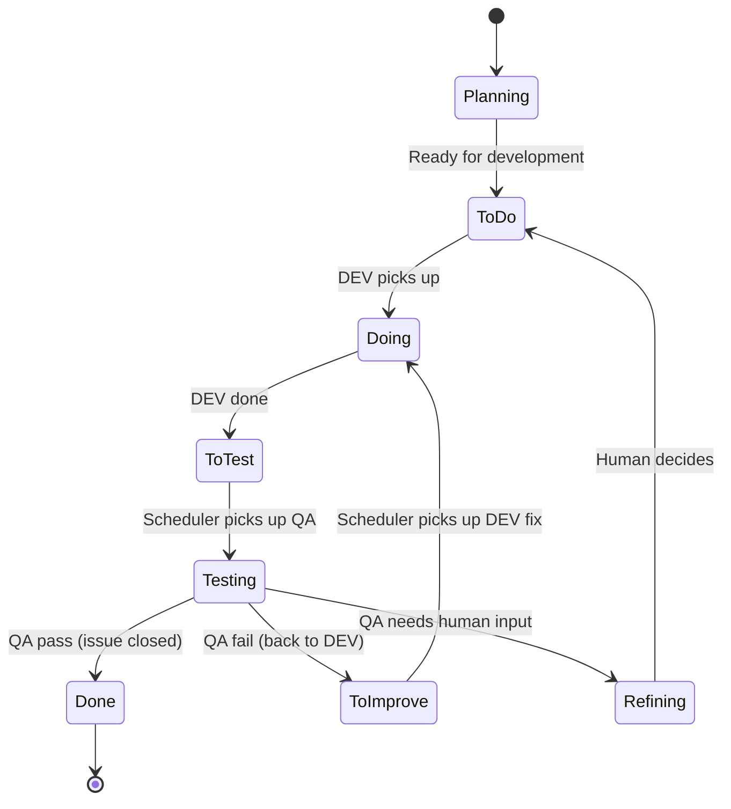

<p align="center">
  
</p>

# DevClaw

**Turn any group chat into a dev team that ships.**

DevClaw is a plugin for [OpenClaw](https://openclaw.ai) that turns your orchestrator agent into a development manager. It hires developers, assigns tasks, reviews code, and keeps the pipeline moving — across as many projects as you have group chats.

---

## What it looks like

You have two projects in two Telegram groups. You go to bed. You wake up:

```
── Group: "Dev - My Webapp" ──────────────────────────────

Agent:  "⚡ Sending DEV (medior) for #42: Add login page"
Agent:  "✅ DEV DONE #42 — Login page with OAuth. Moved to QA."
Agent:  "🔍 Sending QA (reviewer) for #42: Add login page"
Agent:  "🎉 QA PASS #42. Issue closed."
Agent:  "⚡ Sending DEV (junior) for #43: Fix button color on /settings"
Agent:  "✅ DEV DONE #43 — Updated to brand blue. Moved to QA."
Agent:  "🔍 Sending QA (reviewer) for #43: Fix button color on /settings"
Agent:  "❌ QA FAIL #43 — Color doesn't match dark mode. Back to DEV."
Agent:  "⚡ Sending DEV (junior) for #43: Fix button color on /settings"

── Group: "Dev - My API" ─────────────────────────────────

Agent:  "🧠 Spawning DEV (senior) for #18: Migrate auth to OAuth2"
Agent:  "✅ DEV DONE #18 — OAuth2 provider with refresh tokens. Moved to QA."
Agent:  "🔍 Sending QA (reviewer) for #18: Migrate auth to OAuth2"
Agent:  "🎉 QA PASS #18. Issue closed."
Agent:  "⚡ Sending DEV (medior) for #19: Add rate limiting to /api/search"

── You jump in ─────────────────────────────────────────

You:    "How's the frontend looking?"
Agent:  "#41 shipped, #42 shipped, #43 back in DEV (dark-mode fix).
         1 issue left in To Do. DEV is working, QA is idle."

You:    "We need to refactor the profile page before we add settings.
         Create an issue for that, mark it high priority, and pick it up."
Agent:  creates #44 "Refactor user profile page" — To Do, priority: high
Agent:  "⚡ Sending DEV (medior) for #44: Refactor user profile page"

You:    "Also create an issue for adding the settings page.
         Keep it in Planning until #44 is done."
Agent:  creates #45 "Add settings page" — Planning
Agent:  "Parked in Planning. I'll move it to To Do once #44 ships."

You:    "Push these to Linear."
Agent:  synced #44 → LIN-312 "Refactor user profile page"
Agent:  synced #45 → LIN-313 "Add settings page"
Agent:  "Both issues synced to Linear."

── Autonomous work continues ───────────────────────────

Agent:  "✅ DEV DONE #43 — Fixed dark-mode color. Back to QA."
Agent:  "🎉 QA PASS #43. Issue closed."
Agent:  "✅ DEV DONE #44 — Profile page refactored. Moved to QA."
Agent:  "📋 Moving #45 to To Do — dependency #44 is in QA."
```

Three issues shipped, one sent back for a fix (the scheduler retried it automatically), another project's migration completed — all while you slept. And when you dropped in, you planned work, reprioritized, and synced to your external tracker without leaving the chat. The heartbeat kept going before, during, and after.

---

## Why DevClaw

### Autonomous multi-project development

Every project runs in [complete isolation](#execution-modes) with its own queue, workers, and sessions. DEV and QA [execute in parallel](#execution-modes) within each project, and [multiple projects run simultaneously](#execution-modes). The [scheduling engine](#automatic-scheduling) ties it together: a token-free `work_heartbeat` continuously scans queues, dispatches workers, and drives [DEV → QA → DEV feedback loops](#how-tasks-flow-between-roles) — no human in the loop. Workers receive [custom instructions per project per role](#custom-instructions-per-project) at dispatch time: test commands, coding standards, deployment steps.

### Process enforcement

Task state lives in your [existing issue tracker](#your-issues-stay-in-your-tracker) — GitHub or GitLab issues — as the single source of truth. Every tool call is an [atomic operation with rollback](#what-atomic-means-here): label transitions, state updates, session dispatch, and audit logging happen in deterministic code. The agent says what to do; [11 tools enforce how it gets done](#the-toolbox).

### Token savings

[Tier selection](#meet-your-team) routes tasks to the cheapest model that can handle them — Haiku for typos, Opus for architecture (**~30-50%** on simple tasks). [Session reuse](#sessions-accumulate-context) preserves accumulated codebase knowledge across tasks (**~40-60%** per task). The [scheduling engine](#automatic-scheduling) runs on pure CLI calls — **zero** LLM tokens for orchestration. Combined: **~60-80% reduction** versus running everything through one model with fresh context each time.

---

## The problem DevClaw solves

OpenClaw is a great multi-agent runtime. It handles sessions, tools, channels, gateway RPC — everything you need to run AI agents. But it's a general-purpose platform. It has no opinion about how software gets built.

Without DevClaw, your orchestrator agent has to figure out on its own how to:
- Pick the right model for the task complexity
- Create or reuse the right worker session
- Transition issue labels in the right order
- Track which worker is doing what across projects
- Schedule QA after DEV completes, and re-schedule DEV after QA fails
- Detect crashed workers and recover
- Log everything for auditability

That's a lot of reasoning per task. LLMs do it imperfectly — they forget steps, corrupt state, pick the wrong model, lose session references. You end up babysitting the thing you built to avoid babysitting.

DevClaw moves all of that into deterministic plugin code. The agent says "pick up issue #42." The plugin handles the other 10 steps atomically. Every time, the same way, zero reasoning tokens spent on orchestration.

---

## Meet your team

DevClaw doesn't think in model IDs. It thinks in people.

When a task comes in, you don't configure `anthropic/claude-sonnet-4-5` — you assign a **medior developer**. The orchestrator evaluates task complexity and picks the right person for the job:

### Developers

| Level | Assigns to | Model |
|---|---|---|
| **Junior** | Typos, CSS fixes, renames, single-file changes | Haiku |
| **Medior** | Features, bug fixes, multi-file changes | Sonnet |
| **Senior** | Architecture, migrations, system-wide refactoring | Opus |

### QA

| Level | Assigns to | Model |
|---|---|---|
| **Reviewer** | Code review, test validation, PR inspection | Sonnet |
| **Tester** | Manual testing, smoke tests | Haiku |

A CSS typo gets the intern. A database migration gets the architect. You're not burning Opus tokens on a color change, and you're not sending Haiku to redesign your auth system.

Every mapping is [configurable](docs/CONFIGURATION.md#model-tiers) — swap in any model you want per level.

---

## How a task moves through the pipeline

Every issue follows the same path, no exceptions. DevClaw enforces it:

```
Planning → To Do → Doing → To Test → Testing → Done
```



These labels live on your actual GitHub/GitLab issues. Not in some internal database — in the tool you already use. Filter by `Doing` in GitHub to see what's in progress. Set up a webhook on `Done` to trigger deploys. The issue tracker is the source of truth.

### What "atomic" means here

When you say "pick up #42 for DEV", the plugin does all of this in one operation:
1. Verifies the issue is in the right state
2. Picks the developer level (or uses what you specified)
3. Transitions the label (`To Do` → `Doing`)
4. Creates or reuses the right worker session
5. Dispatches the task with project-specific instructions
6. Updates internal state
7. Logs an audit entry

If step 4 fails, step 3 is rolled back. No half-states, no orphaned labels, no "the issue says Doing but nobody's working on it."

---

## What happens behind the scenes

### Workers report back themselves

When a developer finishes, they call `work_finish` directly — no orchestrator involved:

- **DEV "done"** → label moves to `To Test`, scheduler picks up QA on next tick
- **DEV "blocked"** → label moves back to `To Do`, task returns to queue
- **QA "pass"** → label moves to `Done`, issue closes
- **QA "fail"** → label moves to `To Improve`, scheduler picks up DEV on next tick

The orchestrator doesn't need to poll, check, or coordinate. Workers are self-reporting.

### Sessions accumulate context

Each developer level gets its own persistent session per project. Your medior dev that's done 5 features on `my-app` already knows the codebase — it doesn't re-read 50K tokens of source code every time it picks up a new task.

That's a **~40-60% token saving per task** from session reuse alone.

Combined with tier selection (not using Opus when Haiku will do) and the token-free heartbeat (more on that next), DevClaw significantly reduces your token bill versus running everything through one large model.

### Everything is logged

Every tool call writes an NDJSON line to `audit.log`:

```bash
cat audit.log | jq 'select(.event=="work_start")'
```

Full trace of every task, every level selection, every label transition, every health fix. No manual logging needed.

---

## Automatic scheduling

DevClaw doesn't wait for you to tell it what to do next. A background scheduling system continuously scans for available work and dispatches workers — zero LLM tokens, pure deterministic code. This is the engine that keeps the pipeline moving: when DEV finishes, the scheduler sees a `To Test` issue and dispatches QA. When QA fails, the scheduler sees a `To Improve` issue and dispatches DEV. No hand-offs, no orchestrator reasoning — just label-driven scheduling.

### The `work_heartbeat`

Every tick (default: 60 seconds), the scheduler runs two passes:

1. **Health pass** — detects workers stuck for >2 hours, reverts their labels back to queue, deactivates them. Catches crashed sessions, context overflows, or workers that died without reporting back.
2. **Queue pass** — scans for available tasks by priority (`To Improve` > `To Test` > `To Do`), fills free worker slots. DEV and QA slots are filled independently.

All CLI calls and JSON reads. Workers only consume tokens when they actually start coding or reviewing. The scheduler also fires immediately after every `work_finish` (as a tick), so transitions happen without waiting for the next interval.

### How tasks flow between roles

When a worker calls `work_finish`, the plugin transitions the label. The scheduler picks up the rest:

- **DEV "done"** → label moves to `To Test` → next tick dispatches QA
- **QA "fail"** → label moves to `To Improve` → next tick dispatches DEV (reuses previous level)
- **QA "pass"** → label moves to `Done`, issue closes
- **"blocked"** → label reverts to queue (`To Do` or `To Test`) for retry

No orchestrator involvement. Workers self-report, the scheduler fills free slots.

### Execution modes

Each project is fully isolated — its own queue, workers, sessions, state. No cross-project contamination. Two levels of parallelism control how work gets scheduled:

- **Project-level (`roleExecution`)** — DEV and QA work simultaneously on different tasks (default: `parallel`) or take turns (`sequential`)
- **Plugin-level (`projectExecution`)** — all registered projects dispatch workers independently (default: `parallel`) or only one project runs at a time (`sequential`)

### Configuration

All scheduling behavior is configurable in `openclaw.json`:

```json
{
  "plugins": {
    "entries": {
      "devclaw": {
        "config": {
          "work_heartbeat": {
            "enabled": true,
            "intervalSeconds": 60,
            "maxPickupsPerTick": 4
          },
          "projectExecution": "parallel"
        }
      }
    }
  }
}
```

Per-project settings live in `projects.json`:

```json
{
  "-1234567890": {
    "name": "my-app",
    "roleExecution": "parallel"
  }
}
```

| Setting | Where | Default | What it controls |
|---|---|---|---|
| `work_heartbeat.enabled` | `openclaw.json` | `true` | Turn the heartbeat on/off |
| `work_heartbeat.intervalSeconds` | `openclaw.json` | `60` | Seconds between ticks |
| `work_heartbeat.maxPickupsPerTick` | `openclaw.json` | `4` | Max workers dispatched per tick |
| `projectExecution` | `openclaw.json` | `"parallel"` | All projects at once, or one at a time |
| `roleExecution` | `projects.json` | `"parallel"` | DEV+QA at once, or one role at a time |

See the [Configuration reference](docs/CONFIGURATION.md) for the full schema.

---

## Task management

### Your issues stay in your tracker

DevClaw doesn't have its own task database. All task state lives in **GitHub Issues** or **GitLab Issues** — auto-detected from your git remote. The eight pipeline labels are created on your repo when you register a project. Your project manager sees progress in GitHub without knowing DevClaw exists. Your CI/CD can trigger on label changes. If you stop using DevClaw, your issues and labels stay exactly where they are.

The provider is pluggable (`IssueProvider` interface). GitHub and GitLab work today. Jira, Linear, or anything else just needs to implement the same interface.

### Creating, updating, and commenting

Tasks can come from anywhere — the orchestrator creates them from chat, workers file bugs they discover mid-task, or you create them directly in GitHub/GitLab:

```
You:    "Create an issue: fix the broken OAuth redirect"
Agent:  creates issue #43 with label "Planning"

You:    "Move #43 to To Do"
Agent:  transitions label Planning → To Do

You:    "Add a comment on #42: needs to handle the edge case for expired tokens"
Agent:  adds comment attributed to "orchestrator"
```

Workers can also comment during work — QA leaves review feedback, DEV posts implementation notes. Every comment carries role attribution so you know who said what.

### Custom instructions per project

Each project gets instruction files that workers receive with every task they pick up:

```
workspace/projects/roles/
├── my-webapp/
│   ├── dev.md     "Run npm test before committing. Deploy URL: staging.example.com"
│   └── qa.md      "Check OAuth flow. Verify mobile responsiveness."
├── my-api/
│   ├── dev.md     "Run cargo test. Follow REST conventions in CONTRIBUTING.md"
│   └── qa.md      "Verify all endpoints return correct status codes."
└── default/
    ├── dev.md     (fallback for projects without custom instructions)
    └── qa.md
```

Deployment steps, test commands, coding standards, acceptance criteria — all injected at dispatch time, per project, per role.

---

## Getting started

### Prerequisites

- [OpenClaw](https://openclaw.ai) installed (`openclaw --version`)
- Node.js >= 20
- `gh` CLI ([GitHub](https://cli.github.com)) or `glab` CLI ([GitLab](https://gitlab.com/gitlab-org/cli)), authenticated

### Install

```bash
cp -r devclaw ~/.openclaw/extensions/
```

### Set up through conversation

The easiest way to configure DevClaw is to just talk to your agent:

```
You:   "Help me set up DevClaw"
Agent: "I'll walk you through it. Should I use this agent as the
        orchestrator, or create a new one?"
You:   "Use this one"

Agent: "Want to bind a messaging channel?"
You:   "Telegram"

Agent: "Here are the default developer assignments:
        Junior → Haiku, Medior → Sonnet, Senior → Opus
        Reviewer → Sonnet, Tester → Haiku
        Keep these or customize?"
You:   "Keep them"

Agent: "Done. Want to register a project?"
You:   "Yes — my-app at ~/git/my-app, main branch"

Agent: "Project registered. 8 labels created on your repo.
        Role instructions scaffolded. Try: 'check the queue'"
```

You can also use the [CLI wizard or non-interactive setup](docs/ONBOARDING.md#step-2-run-setup) for scripted environments.

---

## The toolbox

DevClaw gives the orchestrator 11 tools. These aren't just convenience wrappers — they're **guardrails**. Each tool encodes a complex multi-step operation into a single atomic call. The agent provides intent, the plugin handles mechanics. The agent physically cannot skip a label transition, forget to update state, or dispatch to the wrong session — those decisions are made by deterministic code, not LLM reasoning.

| Tool | What it does |
|---|---|
| `work_start` | Pick up a task — resolves level, transitions label, dispatches session, logs audit |
| `work_finish` | Complete a task — transitions label, updates state, ticks queue for next dispatch |
| `task_create` | Create a new issue (used by workers to file bugs they discover) |
| `task_update` | Manually change an issue's state label |
| `task_comment` | Add a comment to an issue (with role attribution) |
| `status` | Dashboard: queue counts + who's working on what |
| `health` | Detect zombie workers, stale sessions, state inconsistencies |
| `work_heartbeat` | Manually trigger a health check + queue dispatch cycle |
| `project_register` | One-time project setup: creates labels, scaffolds instructions, initializes state |
| `setup` | Agent + workspace initialization |
| `onboard` | Conversational setup guide |

Full parameters and usage in the [Tools Reference](docs/TOOLS.md).

---

## Documentation

| | |
|---|---|
| **[Architecture](docs/ARCHITECTURE.md)** | System design, session model, data flow, end-to-end diagrams |
| **[Tools Reference](docs/TOOLS.md)** | Complete reference for all 11 tools |
| **[Configuration](docs/CONFIGURATION.md)** | `openclaw.json`, `projects.json`, heartbeat, notifications |
| **[Onboarding Guide](docs/ONBOARDING.md)** | Full step-by-step setup |
| **[QA Workflow](docs/QA_WORKFLOW.md)** | QA process and review templates |
| **[Context Awareness](docs/CONTEXT-AWARENESS.md)** | How tools adapt to group vs. DM vs. agent context |
| **[Testing](docs/TESTING.md)** | Test suite, fixtures, CI/CD |
| **[Management Theory](docs/MANAGEMENT.md)** | The delegation model behind the design |
| **[Roadmap](docs/ROADMAP.md)** | What's coming next |

---

## License

MIT
