# DevClaw — Architecture & Component Interaction

## How it works

One OpenClaw agent process serves multiple group chats — each group gives it a different project context. The orchestrator role, the workers, the task queue, and all state are fully isolated per group.


Worker sessions are expensive to start — each new spawn reads the full codebase (~50K tokens). DevClaw maintains **separate sessions per level per role** ([session-per-level design](#session-per-level-design)). When a medior dev finishes task A and picks up task B on the same project, the accumulated context carries over — no re-reading the repo. The plugin handles all session dispatch internally via OpenClaw CLI; the orchestrator agent never calls `sessions_spawn` or `sessions_send`.

```mermaid
sequenceDiagram
    participant O as Orchestrator
    participant DC as DevClaw Plugin
    participant IT as Issue Tracker
    participant S as Worker Session

    O->>DC: work_start({ issueId: 42, role: "dev" })
    DC->>IT: Fetch issue, verify label
    DC->>DC: Assign level (junior/medior/senior)
    DC->>DC: Check existing session for assigned level
    DC->>IT: Transition label (To Do → Doing)
    DC->>S: Dispatch task via CLI (create or reuse session)
    DC->>DC: Update projects.json, write audit log
    DC-->>O: { success: true, announcement: "..." }
```



## Agents vs Sessions

Understanding the OpenClaw model is key to understanding how DevClaw works:

- **Agent** — A configured entity in `openclaw.json`. Has a workspace, model, identity files (SOUL.md, IDENTITY.md), and tool permissions. Persists across restarts.
- **Session** — A runtime conversation instance. Each session has its own context window and conversation history, stored as a `.jsonl` transcript file.
- **Sub-agent session** — A session created under the orchestrator agent for a specific worker role. NOT a separate agent — it's a child session running under the same agent, with its own isolated context. Format: `agent:<parent>:subagent:<project>-<role>-<level>`.

### Session-per-level design

Each project maintains **separate sessions per developer level per role**. A project's DEV might have a junior session, a medior session, and a senior session — each accumulating its own codebase context over time.

```
Orchestrator Agent (configured in openclaw.json)
  └─ Main session (long-lived, handles all projects)
       │
       ├─ Project A
       │    ├─ DEV sessions: { junior: <key>, medior: <key>, senior: null }
       │    └─ QA sessions:  { reviewer: <key>, tester: null }
       │
       └─ Project B
            ├─ DEV sessions: { junior: null, medior: <key>, senior: null }
            └─ QA sessions:  { reviewer: <key>, tester: null }
```

Why per-level instead of switching models on one session:
- **No model switching overhead** — each session always uses the same model
- **Accumulated context** — a junior session that's done 20 typo fixes knows the project well; a medior session that's done 5 features knows it differently
- **No cross-model confusion** — conversation history stays with the model that generated it
- **Deterministic reuse** — level selection directly maps to a session key, no patching needed

### Plugin-controlled session lifecycle

DevClaw controls the **full** session lifecycle end-to-end. The orchestrator agent never calls `sessions_spawn` or `sessions_send` — the plugin handles session creation and task dispatch internally using the OpenClaw CLI:

```
Plugin dispatch (inside work_start):
  1. Assign level, look up session, decide spawn vs send
  2. New session:  openclaw gateway call sessions.patch → create entry + set model
                   openclaw gateway call agent → dispatch task
  3. Existing:     openclaw gateway call agent → dispatch task to existing session
  4. Return result to orchestrator (announcement text, no session instructions)
```

The agent's only job after `work_start` returns is to post the announcement to Telegram. Everything else — level assignment, session creation, task dispatch, state update, audit logging — is deterministic plugin code.

**Why this matters:** Previously the plugin returned instructions like `{ sessionAction: "spawn", model: "sonnet" }` and the agent had to correctly call `sessions_spawn` with the right params. This was the fragile handoff point where agents would forget `cleanup: "keep"`, use wrong models, or corrupt session state. Moving dispatch into the plugin eliminates that entire class of errors.

**Session persistence:** Sessions created via `sessions.patch` persist indefinitely (no auto-cleanup). The plugin manages lifecycle explicitly through the `health` tool.

**What we trade off vs. registered sub-agents:**

| Feature | Sub-agent system | Plugin-controlled | DevClaw equivalent |
|---|---|---|---|
| Auto-reporting | Sub-agent reports to parent | No | Heartbeat polls for completion |
| Concurrency control | `maxConcurrent` | No | `work_start` checks `active` flag |
| Lifecycle tracking | Parent-child registry | No | `projects.json` tracks all sessions |
| Timeout detection | `runTimeoutSeconds` | No | `health` flags stale >2h |
| Cleanup | Auto-archive | No | `health` manual cleanup |

DevClaw provides equivalent guardrails for everything except auto-reporting, which the heartbeat handles.

## System overview


## End-to-end flow: human to sub-agent

This diagram shows the complete path from a human message in Telegram through to a sub-agent session working on code:


On the **next DEV task** for this project that also assigns medior:

```mermaid
sequenceDiagram
    participant MS as Main Session
    participant DC as DevClaw Plugin
    participant CLI as openclaw gateway call agent
    participant DEV as DEV Session<br/>(medior, existing)

    MS->>DC: work_start({ issueId: 57, role: "dev", level: "medior", ... })
    DC->>DC: resolve level "medior" → model ID
    DC->>DC: lookup dev.sessions.medior → existing key!
    Note over DC: No sessions.patch needed — session already exists
    DC->>CLI: openclaw gateway call agent --params { sessionKey, message }
    CLI->>DEV: delivers task to existing session (has full codebase context)
    DC-->>MS: { success: true, announcement: "⚡ Sending DEV (medior) for #57" }
```



Session reuse saves ~50K tokens per task by not re-reading the codebase.

## Complete ticket lifecycle

This traces a single issue from creation to completion, showing every component interaction, data write, and message.

### Phase 1: Issue created

Issues are created by the orchestrator agent or by sub-agent sessions via `task_create` or directly via `gh`/`glab`. The orchestrator can create issues based on user requests in Telegram, backlog planning, or QA feedback. Sub-agents can also create issues when they discover bugs during development.

```
Orchestrator Agent → Issue Tracker: creates issue #42 with label "Planning"
```

**State:** Issue tracker has issue #42 labeled "Planning". Nothing in DevClaw yet.

### Phase 2: Heartbeat detects work

```
Heartbeat triggers → Orchestrator calls status()
```


**Orchestrator decides:** DEV is idle, issue #42 is in To Do → pick it up. Evaluates complexity → assigns medior level.

### Phase 3: DEV pickup

The plugin handles everything end-to-end — level resolution, session lookup, label transition, state update, **and** task dispatch to the worker session. The agent's only job after is to post the announcement.

```mermaid
sequenceDiagram
    participant A as Orchestrator
    participant WS as work_start
    participant GL as Issue Tracker
    participant TIER as Level Resolver
    participant GW as Gateway RPC
    participant CLI as openclaw gateway call agent
    participant PJ as projects.json
    participant AL as audit.log

    A->>WS: work_start({ issueId: 42, role: "dev", projectGroupId: "-123", level: "medior" })
    WS->>PJ: readProjects()
    WS->>GL: getIssue(42)
    GL-->>WS: { title: "Add login page", labels: ["To Do"] }
    WS->>WS: Verify label is "To Do"
    WS->>TIER: resolve "medior" → "anthropic/claude-sonnet-4-5"
    WS->>PJ: lookup dev.sessions.medior
    WS->>GL: transitionLabel(42, "To Do", "Doing")
    alt New session
        WS->>GW: sessions.patch({ key: new-key, model: "anthropic/claude-sonnet-4-5" })
    end
    WS->>CLI: openclaw gateway call agent --params { sessionKey, message }
    WS->>PJ: activateWorker + store session key
    WS->>AL: append work_start + model_selection
    WS-->>A: { success: true, announcement: "🔧 ..." }
```



**Writes:**
- `Issue Tracker`: label "To Do" → "Doing"
- `projects.json`: dev.active=true, dev.issueId="42", dev.level="medior", dev.sessions.medior=key
- `audit.log`: 2 entries (work_start, model_selection)
- `Session`: task message delivered to worker session via CLI

### Phase 4: DEV works

```
DEV sub-agent session → reads codebase, writes code, creates MR
DEV sub-agent session → calls work_finish({ role: "dev", result: "done", ... })
```

This happens inside the OpenClaw session. The worker calls `work_finish` directly for atomic state updates. If the worker discovers unrelated bugs, it calls `task_create` to file them.

### Phase 5: DEV complete (worker self-reports)

```mermaid
sequenceDiagram
    participant DEV as DEV Session
    participant WF as work_finish
    participant GL as Issue Tracker
    participant PJ as projects.json
    participant AL as audit.log
    participant REPO as Git Repo
    participant QA as QA Session

    DEV->>WF: work_finish({ role: "dev", result: "done", projectGroupId: "-123", summary: "Login page with OAuth" })
    WF->>PJ: readProjects()
    PJ-->>WF: { dev: { active: true, issueId: "42" } }
    WF->>REPO: git pull
    WF->>PJ: deactivateWorker(-123, dev)
    Note over PJ: active→false, issueId→null<br/>sessions map PRESERVED
    WF->>GL: transitionLabel "Doing" → "To Test"
    WF->>AL: append { event: "work_finish", role: "dev", result: "done" }

    WF->>WF: tick queue (fill free slots)
    Note over WF: Scheduler sees "To Test" issue, QA slot free → dispatches QA
    WF-->>DEV: { announcement: "✅ DEV DONE #42", tickPickups: [...] }
```



**Writes:**
- `Git repo`: pulled latest (has DEV's merged code)
- `projects.json`: dev.active=false, dev.issueId=null (sessions map preserved for reuse)
- `Issue Tracker`: label "Doing" → "To Test"
- `audit.log`: 1 entry (work_finish) + tick entries if workers dispatched

### Phase 6: QA pickup

Same as Phase 3, but with `role: "qa"`. Label transitions "To Test" → "Testing". Uses the reviewer level.

### Phase 7: QA result (4 possible outcomes)

#### 7a. QA Pass

```mermaid
sequenceDiagram
    participant QA as QA Session
    participant WF as work_finish
    participant GL as Issue Tracker
    participant PJ as projects.json
    participant AL as audit.log

    QA->>WF: work_finish({ role: "qa", result: "pass", projectGroupId: "-123" })
    WF->>PJ: deactivateWorker(-123, qa)
    WF->>GL: transitionLabel(42, "Testing", "Done")
    WF->>GL: closeIssue(42)
    WF->>AL: append { event: "work_finish", role: "qa", result: "pass" }
    WF-->>QA: { announcement: "🎉 QA PASS #42. Issue closed." }
```



**Ticket complete.** Issue closed, label "Done".

#### 7b. QA Fail


**Cycle restarts:** Issue goes to "To Improve". Next heartbeat, DEV picks it up again (Phase 3, but from "To Improve" instead of "To Do").

#### 7c. QA Refine

```
Label: "Testing" → "Refining"
```

Issue needs human decision. Pipeline pauses until human moves it to "To Do" or closes it.

#### 7d. Blocked (DEV or QA)

```
DEV Blocked: "Doing" → "To Do"
QA Blocked:  "Testing" → "To Test"
```

Worker cannot complete (missing info, environment errors, etc.). Issue returns to queue for retry. The task is available for the next heartbeat pickup.

### Completion enforcement

Three layers guarantee that `work_finish` always runs:

1. **Completion contract** — Every task message sent to a worker session includes a mandatory `## MANDATORY: Task Completion` section listing available results and requiring `work_finish` even on failure. Workers are instructed to use `"blocked"` if stuck.

2. **Blocked result** — Both DEV and QA can use `"blocked"` to gracefully return a task to queue without losing work. DEV blocked: `Doing → To Do`. QA blocked: `Testing → To Test`. This gives workers an escape hatch instead of silently dying.

3. **Stale worker watchdog** — The heartbeat's health check detects workers active for >2 hours. With `fix=true`, it deactivates the worker and reverts the label back to queue. This catches sessions that crashed, ran out of context, or otherwise failed without calling `work_finish`. The `health` tool provides the same check for manual invocation.

### Phase 8: Heartbeat (continuous)

The heartbeat runs periodically (via background service or manual `work_heartbeat` trigger). It combines health check + queue scan:


## Data flow map

Every piece of data and where it lives:

```
┌─────────────────────────────────────────────────────────────────┐
│ Issue Tracker (source of truth for tasks)                       │
│                                                                 │
│  Issue #42: "Add login page"                                    │
│  Labels: [Planning | To Do | Doing | To Test | Testing | ...]   │
│  State: open / closed                                           │
│  MRs/PRs: linked merge/pull requests                            │
│  Created by: orchestrator (task_create), workers, or humans     │
└─────────────────────────────────────────────────────────────────┘
        ↕ gh/glab CLI (read/write, auto-detected)
┌─────────────────────────────────────────────────────────────────┐
│ DevClaw Plugin (orchestration logic)                            │
│                                                                 │
│  setup          → agent creation + workspace + model config     │
│  work_start     → level + label + dispatch + role instr (e2e)   │
│  work_finish    → label + state + git pull + tick queue          │
│  task_create    → create issue in tracker                       │
│  task_update    → manual label state change                     │
│  task_comment   → add comment to issue                          │
│  status         → read labels + read state                      │
│  health         → check sessions + fix zombies                  │
│  project_register → labels + prompts + state init (one-time)    │
└─────────────────────────────────────────────────────────────────┘
        ↕ atomic file I/O          ↕ OpenClaw CLI (plugin shells out)
┌────────────────────────────────┐ ┌──────────────────────────────┐
│ projects/projects.json         │ │ OpenClaw Gateway + CLI       │
│                                │ │ (called by plugin, not agent)│
│  Per project:                  │ │                              │
│    dev:                        │ │  openclaw gateway call       │
│      active, issueId, level    │ │    sessions.patch → create   │
│      sessions:                 │ │    sessions.list  → health   │
│        junior: <key>           │ │    sessions.delete → cleanup │
│        medior: <key>           │ │                              │
│        senior: <key>           │ │  openclaw gateway call agent │
│    qa:                         │ │    --params { sessionKey,    │
│      active, issueId, level    │ │      message, agentId }      │
│      sessions:                 │ │    → dispatches to session   │
│        reviewer: <key>         │ │                              │
│        tester: <key>           │ │                              │
└────────────────────────────────┘ └──────────────────────────────┘
        ↕ append-only
┌─────────────────────────────────────────────────────────────────┐
│ log/audit.log (observability)                                   │
│                                                                 │
│  NDJSON, one line per event:                                    │
│  work_start, work_finish, model_selection,                      │
│  status, health, task_create, task_update,                      │
│  task_comment, project_register, setup, heartbeat_tick          │
│                                                                 │
│  Query: cat audit.log | jq 'select(.event=="work_start")'      │
└─────────────────────────────────────────────────────────────────┘

┌─────────────────────────────────────────────────────────────────┐
│ Telegram / WhatsApp (user-facing messages)                      │
│                                                                 │
│  Per group chat:                                                │
│    "🔧 Spawning DEV (medior) for #42: Add login page"          │
│    "⚡ Sending DEV (medior) for #57: Fix validation"            │
│    "✅ DEV DONE #42 — Login page with OAuth."                   │
│    "🎉 QA PASS #42. Issue closed."                              │
│    "❌ QA FAIL #42 — OAuth redirect broken."                    │
│    "🚫 DEV BLOCKED #42 — Missing dependencies."                │
│    "🚫 QA BLOCKED #42 — Env not available."                    │
└─────────────────────────────────────────────────────────────────┘

┌─────────────────────────────────────────────────────────────────┐
│ Git Repository (codebase)                                       │
│                                                                 │
│  DEV sub-agent sessions: read code, write code, create MRs      │
│  QA sub-agent sessions: read code, run tests, review MRs        │
│  work_finish (DEV done): git pull to sync latest                │
└─────────────────────────────────────────────────────────────────┘
```

## Scope boundaries

What DevClaw controls vs. what it delegates:


**Key boundary:** The orchestrator is a planner and dispatcher — it never writes code. All implementation work (code edits, git operations, tests) must go through sub-agent sessions via the `task_create` → `work_start` pipeline. This ensures audit trails, tier selection, and QA review for every code change.

## IssueProvider abstraction

All issue tracker operations go through the `IssueProvider` interface, defined in `lib/providers/provider.ts`. This abstraction allows DevClaw to support multiple issue trackers without changing tool logic.

**Interface methods:**
- `ensureLabel` / `ensureAllStateLabels` — idempotent label creation
- `createIssue` — create issue with label and assignees
- `listIssuesByLabel` / `getIssue` — issue queries
- `transitionLabel` — atomic label state transition (unlabel + label)
- `closeIssue` / `reopenIssue` — issue lifecycle
- `hasStateLabel` / `getCurrentStateLabel` — label inspection
- `hasMergedMR` / `getMergedMRUrl` — MR/PR verification
- `addComment` — add comment to issue
- `healthCheck` — verify provider connectivity

**Current providers:**
- **GitHub** (`lib/providers/github.ts`) — wraps `gh` CLI
- **GitLab** (`lib/providers/gitlab.ts`) — wraps `glab` CLI

**Planned providers:**
- **Jira** — via REST API

Provider selection is handled by `createProvider()` in `lib/providers/index.ts`. Auto-detects GitHub vs GitLab from the git remote URL.

## Error recovery

| Failure | Detection | Recovery |
|---|---|---|
| Session dies mid-task | `health` checks via `sessions.list` Gateway RPC | `fix=true`: reverts label, clears active state. Next heartbeat picks up task again (creates fresh session for that level). |
| gh/glab command fails | Plugin tool throws error, returns to agent | Agent retries or reports to Telegram group |
| `openclaw gateway call agent` fails | Plugin catches error during dispatch | Plugin rolls back: reverts label, clears active state. Returns error. No orphaned state. |
| `sessions.patch` fails | Plugin catches error during session creation | Plugin rolls back label transition. Returns error. |
| projects.json corrupted | Tool can't parse JSON | Manual fix needed. Atomic writes (temp+rename) prevent partial writes. |
| Label out of sync | `work_start` verifies label before transitioning | Throws error if label doesn't match expected state. |
| Worker already active | `work_start` checks `active` flag | Throws error: "DEV already active on project". Must complete current task first. |
| Stale worker (>2h) | `health` and heartbeat health check | `fix=true`: deactivates worker, reverts label to queue. Task available for next pickup. |
| Worker stuck/blocked | Worker calls `work_finish` with `"blocked"` | Deactivates worker, reverts label to queue. Issue available for retry. |
| `project_register` fails | Plugin catches error during label creation or state write | Clean error returned. Labels are idempotent, projects.json not written until all labels succeed. |

## File locations

| File | Location | Purpose |
|---|---|---|
| Plugin source | `~/.openclaw/extensions/devclaw/` | Plugin code |
| Plugin manifest | `~/.openclaw/extensions/devclaw/openclaw.plugin.json` | Plugin registration |
| Agent config | `~/.openclaw/openclaw.json` | Agent definition + tool permissions + model config |
| Worker state | `~/.openclaw/workspace-<agent>/projects/projects.json` | Per-project DEV/QA state |
| Role instructions | `~/.openclaw/workspace-<agent>/projects/roles/<project>/` | Per-project `dev.md` and `qa.md` |
| Audit log | `~/.openclaw/workspace-<agent>/log/audit.log` | NDJSON event log |
| Session transcripts | `~/.openclaw/agents/<agent>/sessions/<uuid>.jsonl` | Conversation history per session |
| Git repos | `~/git/<project>/` | Project source code |
