# DevClaw — Architecture & Component Interaction

## Agents vs Sessions

Understanding the OpenClaw model is key to understanding how DevClaw works:

- **Agent** — A configured entity in `openclaw.json`. Has a workspace, model, identity files (SOUL.md, IDENTITY.md), and tool permissions. Persists across restarts.
- **Session** — A runtime conversation instance. Each session has its own context window and conversation history, stored as a `.jsonl` transcript file.
- **Sub-agent session** — A session created under the orchestrator agent for a specific worker role. NOT a separate agent — it's a child session running under the same agent, with its own isolated context. Format: `agent:<parent>:subagent:<uuid>`.

### Session-per-model design

Each project maintains **separate sessions per model per role**. A project's DEV might have a Haiku session, a Sonnet session, and an Opus session — each accumulating its own codebase context over time.

```
Orchestrator Agent (configured in openclaw.json)
  └─ Main session (long-lived, handles all projects)
       │
       ├─ Project A
       │    ├─ DEV sessions: { haiku: <uuid>, sonnet: <uuid>, opus: null }
       │    └─ QA sessions:  { grok: <uuid> }
       │
       └─ Project B
            ├─ DEV sessions: { haiku: null, sonnet: <uuid>, opus: null }
            └─ QA sessions:  { grok: <uuid> }
```

Why per-model instead of switching models on one session:
- **No model switching overhead** — each session always uses the same model
- **Accumulated context** — a Haiku session that's done 20 typo fixes knows the project well; a Sonnet session that's done 5 features knows it differently
- **No cross-model confusion** — conversation history stays with the model that generated it
- **Deterministic reuse** — model selection directly maps to a session key, no patching needed

### Plugin-controlled session lifecycle

DevClaw controls the **full** session lifecycle end-to-end. The orchestrator agent never calls `sessions_spawn` or `sessions_send` — the plugin handles session creation and task dispatch internally using the OpenClaw CLI:

```
Plugin dispatch (inside task_pickup):
  1. Select model, look up session, decide spawn vs send
  2. New session:  openclaw gateway call sessions.patch → create entry + set model
                   openclaw agent --session-id <key> --message "task..."
  3. Existing:     openclaw agent --session-id <key> --message "task..."
  4. Return result to orchestrator (announcement text, no session instructions)
```

The agent's only job after `task_pickup` returns is to post the announcement to Telegram. Everything else — model selection, session creation, task dispatch, state update, audit logging — is deterministic plugin code.

**Why this matters:** Previously the plugin returned instructions like `{ sessionAction: "spawn", model: "sonnet" }` and the agent had to correctly call `sessions_spawn` with the right params. This was the fragile handoff point where agents would forget `cleanup: "keep"`, use wrong models, or corrupt session state. Moving dispatch into the plugin eliminates that entire class of errors.

**Session persistence:** Sessions created via `sessions.patch` persist indefinitely (no auto-cleanup). The plugin manages lifecycle explicitly through `session_health`.

**What we trade off vs. registered sub-agents:**

| Feature | Sub-agent system | Plugin-controlled | DevClaw equivalent |
|---|---|---|---|
| Auto-reporting | Sub-agent reports to parent | No | Heartbeat polls for completion |
| Concurrency control | `maxConcurrent` | No | `task_pickup` checks `active` flag |
| Lifecycle tracking | Parent-child registry | No | `projects.json` tracks all sessions |
| Timeout detection | `runTimeoutSeconds` | No | `session_health` flags stale >2h |
| Cleanup | Auto-archive | No | `session_health` manual cleanup |

DevClaw provides equivalent guardrails for everything except auto-reporting, which the heartbeat handles.

## System overview


## End-to-end flow: human to sub-agent

This diagram shows the complete path from a human message in Telegram through to a sub-agent session working on code:

```mermaid
sequenceDiagram
    participant H as Human (Telegram)
    participant TG as Telegram Channel
    participant MS as Main Session<br/>(orchestrator)
    participant DC as DevClaw Plugin
    participant GW as Gateway RPC
    participant CLI as openclaw agent CLI
    participant DEV as DEV Session<br/>(sonnet)
    participant GL as GitLab

    Note over H,GL: Issue exists in queue (To Do)

    H->>TG: "check status" (or heartbeat triggers)
    TG->>MS: delivers message
    MS->>DC: queue_status()
    DC->>GL: glab issue list --label "To Do"
    DC-->>MS: { toDo: [#42], dev: idle }

    Note over MS: Decides to pick up #42 for DEV

    MS->>DC: task_pickup({ issueId: 42, role: "dev", ... })
    DC->>DC: selectModel → "sonnet"
    DC->>DC: lookup dev.sessions.sonnet → null (first time)
    DC->>GL: glab issue update 42 --unlabel "To Do" --label "Doing"
    DC->>GW: sessions.patch({ key: new-session-key, model: "sonnet" })
    DC->>CLI: openclaw agent --session-id <key> --message "Build login page for #42..."
    CLI->>DEV: creates session, delivers task
    DC->>DC: store session key in projects.json + append audit.log
    DC-->>MS: { success: true, announcement: "🔧 DEV (sonnet) picking up #42" }

    MS->>TG: "🔧 DEV (sonnet) picking up #42: Add login page"
    TG->>H: sees announcement

    Note over DEV: Works autonomously — reads code, writes code, creates MR
    Note over MS: Heartbeat detects DEV session idle → triggers task_complete

    MS->>DC: task_complete({ role: "dev", result: "done", ... })
    DC->>GL: glab issue update 42 --unlabel "Doing" --label "To Test"
    DC->>DC: deactivate worker (sessions preserved)
    DC-->>MS: { announcement: "✅ DEV done #42" }

    MS->>TG: "✅ DEV done #42 — moved to QA queue"
    TG->>H: sees announcement
```



On the **next DEV task** for this project that also selects Sonnet:


Session reuse saves ~50K tokens per task by not re-reading the codebase.

## Complete ticket lifecycle

This traces a single issue from creation to completion, showing every component interaction, data write, and message.

### Phase 1: Issue created

Issues are created by the orchestrator agent or by sub-agent sessions via `glab`. The orchestrator can create issues based on user requests in Telegram, backlog planning, or QA feedback. Sub-agents can also create issues when they discover bugs or related work during development.

```
Orchestrator Agent → GitLab: creates issue #42 with label "To Do"
```

**State:** GitLab has issue #42 labeled "To Do". Nothing in DevClaw yet.

### Phase 2: Heartbeat detects work

```
Heartbeat triggers → Orchestrator calls queue_status()
```


**Orchestrator decides:** DEV is idle, issue #42 is in To Do → pick it up.

### Phase 3: DEV pickup

The plugin handles everything end-to-end — model selection, session lookup, label transition, state update, **and** task dispatch to the worker session. The agent's only job after is to post the announcement.

```mermaid
sequenceDiagram
    participant A as Orchestrator
    participant TP as task_pickup
    participant GL as GitLab
    participant MS as Model Selector
    participant GW as Gateway RPC
    participant CLI as openclaw agent CLI
    participant PJ as projects.json
    participant AL as audit.log

    A->>TP: task_pickup({ issueId: 42, role: "dev", projectGroupId: "-123" })
    TP->>PJ: readProjects()
    TP->>GL: glab issue view 42 --output json
    GL-->>TP: { title: "Add login page", labels: ["To Do"] }
    TP->>TP: Verify label is "To Do" ✓
    TP->>TP: model from agent param (LLM-selected) or fallback heuristic
    TP->>PJ: lookup dev.sessions.sonnet
    TP->>GL: glab issue update 42 --unlabel "To Do" --label "Doing"
    alt New session
        TP->>GW: sessions.patch({ key: new-key, model: "sonnet" })
    end
    TP->>CLI: openclaw agent --session-id <key> --message "task..."
    TP->>PJ: activateWorker + store session key
    TP->>AL: append task_pickup + model_selection
    TP-->>A: { success: true, announcement: "🔧 ..." }
```



**Writes:**
- `GitLab`: label "To Do" → "Doing"
- `projects.json`: dev.active=true, dev.issueId="42", dev.model="sonnet", dev.sessions.sonnet=key
- `audit.log`: 2 entries (task_pickup, model_selection)
- `Session`: task message delivered to worker session via CLI

### Phase 4: DEV works

```
DEV sub-agent session → reads codebase, writes code, creates MR
DEV sub-agent session → calls task_complete({ role: "dev", result: "done", ... })
```

This happens inside the OpenClaw session. The worker calls `task_complete` directly for atomic state updates. If the worker discovers unrelated bugs, it calls `task_create` to file them.

### Phase 5: DEV complete (worker self-reports)

```mermaid
sequenceDiagram
    participant DEV as DEV Session
    participant TC as task_complete
    participant GL as GitLab
    participant PJ as projects.json
    participant AL as audit.log
    participant REPO as Git Repo
    participant QA as QA Session (auto-chain)

    DEV->>TC: task_complete({ role: "dev", result: "done", projectGroupId: "-123", summary: "Login page with OAuth" })
    TC->>PJ: readProjects()
    PJ-->>TC: { dev: { active: true, issueId: "42" } }
    TC->>REPO: git pull
    TC->>PJ: deactivateWorker(-123, dev)
    Note over PJ: active→false, issueId→null<br/>sessions map PRESERVED
    TC->>GL: transition label "Doing" → "To Test"
    TC->>AL: append { event: "task_complete", role: "dev", result: "done" }

    alt autoChain enabled
        TC->>GL: transition label "To Test" → "Testing"
        TC->>QA: dispatchTask(role: "qa", model: "grok")
        TC->>PJ: activateWorker(-123, qa)
        TC-->>DEV: { announcement: "✅ DEV done #42", autoChain: { dispatched: true, role: "qa" } }
    else autoChain disabled
        TC-->>DEV: { announcement: "✅ DEV done #42", nextAction: "qa_pickup" }
    end
```



**Writes:**
- `Git repo`: pulled latest (has DEV's merged code)
- `projects.json`: dev.active=false, dev.issueId=null (sessions map preserved for reuse)
- `GitLab`: label "Doing" → "To Test" (+ "To Test" → "Testing" if auto-chain)
- `audit.log`: 1 entry (task_complete) + optional auto-chain entries

### Phase 6: QA pickup

Same as Phase 3, but with `role: "qa"`. Label transitions "To Test" → "Testing". Model defaults to Grok for QA.

### Phase 7: QA result (3 possible outcomes)

#### 7a. QA Pass

```mermaid
sequenceDiagram
    participant A as Orchestrator
    participant TC as task_complete
    participant GL as GitLab
    participant PJ as projects.json
    participant AL as audit.log

    A->>TC: task_complete({ role: "qa", result: "pass", projectGroupId: "-123" })
    TC->>PJ: deactivateWorker(-123, qa)
    TC->>GL: glab issue update 42 --unlabel "Testing" --label "Done"
    TC->>GL: glab issue close 42
    TC->>AL: append { event: "task_complete", role: "qa", result: "pass" }
    TC-->>A: { announcement: "🎉 QA PASS #42. Issue closed." }
```



**Ticket complete.** Issue closed, label "Done".

#### 7b. QA Fail


**Cycle restarts:** Issue goes to "To Improve". Next heartbeat, DEV picks it up again (Phase 3, but from "To Improve" instead of "To Do").

#### 7c. QA Refine

```
Label: "Testing" → "Refining"
```

Issue needs human decision. Pipeline pauses until human moves it to "To Do" or closes it.

### Phase 8: Heartbeat (continuous)

The heartbeat runs periodically (triggered by the agent or a scheduled message). It combines health check + queue scan:


## Data flow map

Every piece of data and where it lives:

```
┌─────────────────────────────────────────────────────────────────┐
│ Issue Tracker (source of truth for tasks)                        │
│                                                                 │
│  Issue #42: "Add login page"                                    │
│  Labels: [To Do | Doing | To Test | Testing | Done | ...]       │
│  State: open / closed                                           │
│  MRs/PRs: linked merge/pull requests                            │
│  Created by: orchestrator (task_create), workers, or humans     │
└─────────────────────────────────────────────────────────────────┘
        ↕ glab/gh CLI (read/write, auto-detected)
┌─────────────────────────────────────────────────────────────────┐
│ DevClaw Plugin (orchestration logic)                            │
│                                                                 │
│  task_pickup    → model + label + dispatch + role instr (e2e)   │
│  task_complete  → label + state + git pull + auto-chain        │
│  task_create    → create issue in tracker                      │
│  queue_status   → read labels + read state                     │
│  session_health → check sessions + fix zombies                 │
│  project_register → labels + roles + state init (one-time)     │
└─────────────────────────────────────────────────────────────────┘
        ↕ atomic file I/O          ↕ OpenClaw CLI (plugin shells out)
┌────────────────────────────────┐ ┌──────────────────────────────┐
│ memory/projects.json           │ │ OpenClaw Gateway + CLI       │
│                                │ │ (called by plugin, not agent)│
│  Per project:                  │ │                              │
│    dev:                        │ │  openclaw gateway call       │
│      active, issueId, model    │ │    sessions.patch → create   │
│      sessions:                 │ │    sessions.list  → health   │
│        haiku: <key>            │ │    sessions.delete → cleanup │
│        sonnet: <key>           │ │                              │
│        opus: <key>             │ │  openclaw agent              │
│    qa:                         │ │    --session-id <key>        │
│      active, issueId, model    │ │    --message "task..."       │
│      sessions:                 │ │    → dispatches to session   │
│        grok: <key>             │ │                              │
└────────────────────────────────┘ └──────────────────────────────┘
        ↕ append-only
┌─────────────────────────────────────────────────────────────────┐
│ memory/audit.log (observability)                                │
│                                                                 │
│  NDJSON, one line per event:                                    │
│  task_pickup, task_complete, model_selection,                   │
│  queue_status, health_check, session_spawn, session_reuse,     │
│  project_register                                               │
│                                                                 │
│  Query with: cat audit.log | jq 'select(.event=="task_pickup")' │
└─────────────────────────────────────────────────────────────────┘

┌─────────────────────────────────────────────────────────────────┐
│ Telegram (user-facing messages)                                 │
│                                                                 │
│  Per group chat:                                                │
│    "🔧 Spawning DEV (sonnet) for #42: Add login page"           │
│    "⚡ Sending DEV (sonnet) for #57: Fix validation"            │
│    "✅ DEV done #42 — Login page with OAuth. Moved to QA queue."│
│    "🎉 QA PASS #42. Issue closed."                              │
│    "❌ QA FAIL #42 — OAuth redirect broken. Sent back to DEV."  │
└─────────────────────────────────────────────────────────────────┘

┌─────────────────────────────────────────────────────────────────┐
│ Git Repository (codebase)                                       │
│                                                                 │
│  DEV sub-agent sessions: read code, write code, create MRs      │
│  QA sub-agent sessions: read code, run tests, review MRs        │
│  task_complete (DEV done): git pull to sync latest               │
└─────────────────────────────────────────────────────────────────┘
```

## Scope boundaries

What DevClaw controls vs. what it delegates:

```mermaid
graph LR
    subgraph "DevClaw controls (deterministic)"
        L[Label transitions]
        S[Worker state]
        PR[Project registration]
        SD[Session dispatch<br/>create + send via CLI]
        AC[Auto-chaining<br/>DEV→QA, QA fail→DEV]
        RI[Role instructions<br/>loaded per project]
        A[Audit logging]
        Z[Zombie cleanup]
    end

    subgraph "Orchestrator handles"
        MSG[Telegram announcements]
        HB[Heartbeat scheduling]
        DEC[Task prioritization]
        M[Model selection]
    end

    subgraph "Sub-agent sessions handle"
        CR[Code writing]
        MR[MR creation/review]
        TC_W[Task completion<br/>via task_complete]
        BUG[Bug filing<br/>via task_create]
    end

    subgraph "External"
        DEPLOY[Deployment]
        HR[Human decisions]
    end
```



## IssueProvider abstraction

All issue tracker operations go through the `IssueProvider` interface, defined in `lib/issue-provider.ts`. This abstraction allows DevClaw to support multiple issue trackers without changing tool logic.

**Interface methods:**
- `ensureLabel` / `ensureAllStateLabels` — idempotent label creation
- `listIssuesByLabel` / `getIssue` — issue queries
- `transitionLabel` — atomic label state transition (unlabel + label)
- `closeIssue` / `reopenIssue` — issue lifecycle
- `hasStateLabel` / `getCurrentStateLabel` — label inspection
- `hasMergedMR` — MR/PR verification
- `healthCheck` — verify provider connectivity

**Current providers:**
- **GitLab** (`lib/providers/gitlab.ts`) — wraps `glab` CLI
- **GitHub** (`lib/providers/github.ts`) — wraps `gh` CLI

**Planned providers:**
- **Jira** — via REST API

Provider selection is handled by `createProvider()` in `lib/providers/index.ts`. Auto-detects GitHub vs GitLab from the git remote URL.

## Error recovery

| Failure | Detection | Recovery |
|---|---|---|
| Session dies mid-task | `session_health` checks via `sessions.list` Gateway RPC | `autoFix`: reverts label, clears active state, removes dead session from sessions map. Next heartbeat picks up task again (creates fresh session for that model). |
| glab command fails | Plugin tool throws error, returns to agent | Agent retries or reports to Telegram group |
| `openclaw agent` CLI fails | Plugin catches error during dispatch | Plugin rolls back: reverts label, clears active state. Returns error to agent for reporting. |
| `sessions.patch` fails | Plugin catches error during session creation | Plugin rolls back label transition. Returns error. No orphaned state. |
| projects.json corrupted | Tool can't parse JSON | Manual fix needed. Atomic writes (temp+rename) prevent partial writes. |
| Label out of sync | `task_pickup` verifies label before transitioning | Throws error if label doesn't match expected state. Agent reports mismatch. |
| Worker already active | `task_pickup` checks `active` flag | Throws error: "DEV worker already active on project". Must complete current task first. |
| Stale worker (>2h) | `session_health` flags as warning | Agent can investigate or `autoFix` can clear. |
| `project_register` fails | Plugin catches error during label creation or state write | Clean error returned. No partial state — labels are idempotent, projects.json not written until all labels succeed. |

## File locations

| File | Location | Purpose |
|---|---|---|
| Plugin source | `~/.openclaw/extensions/devclaw/` | Plugin code |
| Plugin manifest | `~/.openclaw/extensions/devclaw/openclaw.plugin.json` | Plugin registration |
| Agent config | `~/.openclaw/openclaw.json` | Agent definition + tool permissions |
| Worker state | `~/.openclaw/workspace-<agent>/memory/projects.json` | Per-project DEV/QA state |
| Audit log | `~/.openclaw/workspace-<agent>/memory/audit.log` | NDJSON event log |
| Session transcripts | `~/.openclaw/agents/<agent>/sessions/<uuid>.jsonl` | Conversation history per session |
| Git repos | `~/git/<project>/` | Project source code |
