# DevClaw — Architecture & Component Interaction

## Agents vs Sessions

Understanding the OpenClaw model is key to understanding how DevClaw works:

- **Agent** — A configured entity in `openclaw.json`. Has a workspace, model, identity files (SOUL.md, IDENTITY.md), and tool permissions. Persists across restarts.
- **Session** — A runtime conversation instance. Created when the agent starts or when `sessions_spawn` is called. Each session has its own context window and conversation history.
- **Sub-agent session** — A session spawned by the orchestrator agent via `sessions_spawn`. Despite the name, it is NOT a separate agent — it's a child session running under the same agent, with its own isolated context. Format: `agent:<parent>:subagent:<uuid>`.

DevClaw operates at the **orchestrator agent** level. The orchestrator runs a single long-lived session that manages all projects. For each task, it spawns (or reuses) DEV and QA sub-agent sessions. The plugin handles the orchestration logic — label transitions, state management, model selection, audit logging — and returns structured instructions. The orchestrator agent then executes the actual session operations (`sessions_spawn` or `sessions_send`).

```
Orchestrator Agent (configured in openclaw.json)
  └─ Main session (long-lived, handles all projects)
       ├─ DEV sub-agent session (project A) ← sessions_spawn / sessions_send
       ├─ QA sub-agent session (project A)  ← sessions_spawn / sessions_send
       ├─ DEV sub-agent session (project B)
       └─ QA sub-agent session (project B)
```

## System overview


## Complete ticket lifecycle

This traces a single issue from creation to completion, showing every component interaction, data write, and message.

### Phase 1: Issue created

Issues are created by the orchestrator agent or by sub-agent sessions via `glab`. The orchestrator can create issues based on user requests in Telegram, backlog planning, or QA feedback. Sub-agents can also create issues when they discover bugs or related work during development.

```
Orchestrator Agent → GitLab: creates issue #42 with label "To Do"
```

**State:** GitLab has issue #42 labeled "To Do". Nothing in DevClaw yet.

### Phase 2: Heartbeat detects work

```
Heartbeat triggers → Orchestrator calls queue_status()
```


**Orchestrator decides:** DEV is idle, issue #42 is in To Do → pick it up.

### Phase 3: DEV pickup

```mermaid
sequenceDiagram
    participant A as Orchestrator
    participant TP as task_pickup
    participant GL as GitLab
    participant MS as Model Selector
    participant PJ as projects.json
    participant AL as audit.log
    participant TG as Telegram

    A->>TP: task_pickup({ issueId: 42, role: "dev", projectGroupId: "-123" })
    TP->>PJ: readProjects()
    PJ-->>TP: { dev: { active: false, sessionId: "existing-session" } }
    TP->>GL: glab issue view 42 --output json
    GL-->>TP: { title: "Add login page", labels: ["To Do"] }
    TP->>TP: Verify label is "To Do" ✓
    TP->>MS: selectModel("Add login page", description, "dev")
    MS-->>TP: { alias: "sonnet", reason: "Standard dev task" }
    TP->>TP: Existing session found → sessionAction: "send"
    TP->>GL: glab issue update 42 --unlabel "To Do" --label "Doing"
    TP->>PJ: activateWorker(-123, dev, { issueId: "42", model: "sonnet" })
    TP->>AL: append { event: "task_pickup", ... }
    TP->>AL: append { event: "model_selection", ... }
    TP-->>A: { sessionAction: "send", sessionId: "existing-session", announcement: "..." }
    A->>TG: "🔧 Sending DEV (sonnet) for #42: Add login page"
    A->>A: sessions_send(sessionId, task description)
```



**Writes:**
- `GitLab`: label "To Do" → "Doing"
- `projects.json`: dev.active=true, dev.issueId="42", dev.model="sonnet"
- `audit.log`: 2 entries (task_pickup, model_selection)
- `Telegram`: announcement message

### Phase 4: DEV works

```
DEV sub-agent session → reads codebase, writes code, creates MR
DEV sub-agent session → reports back to orchestrator: "done, MR merged"
```

This happens inside the OpenClaw session. DevClaw is not involved — the DEV sub-agent session works autonomously with the codebase.

### Phase 5: DEV complete

```mermaid
sequenceDiagram
    participant A as Orchestrator
    participant TC as task_complete
    participant GL as GitLab
    participant PJ as projects.json
    participant AL as audit.log
    participant REPO as Git Repo
    participant TG as Telegram

    A->>TC: task_complete({ role: "dev", result: "done", projectGroupId: "-123", summary: "Login page with OAuth" })
    TC->>PJ: readProjects()
    PJ-->>TC: { dev: { active: true, issueId: "42", sessionId: "existing-session" } }
    TC->>REPO: git pull
    TC->>PJ: deactivateWorker(-123, dev)
    Note over PJ: active→false, issueId→null<br/>sessionId PRESERVED<br/>model PRESERVED
    TC->>GL: glab issue update 42 --unlabel "Doing" --label "To Test"
    TC->>AL: append { event: "task_complete", role: "dev", result: "done" }
    TC-->>A: { announcement: "✅ DEV done #42 — Login page with OAuth. Moved to QA queue." }
    A->>TG: "✅ DEV done #42 — Login page with OAuth. Moved to QA queue."
```



**Writes:**
- `Git repo`: pulled latest (has DEV's merged code)
- `projects.json`: dev.active=false, dev.issueId=null (sessionId + model preserved for reuse)
- `GitLab`: label "Doing" → "To Test"
- `audit.log`: 1 entry (task_complete)
- `Telegram`: announcement

### Phase 6: QA pickup

Same as Phase 3, but with `role: "qa"`. Label transitions "To Test" → "Testing". Model defaults to Grok for QA.

### Phase 7: QA result (3 possible outcomes)

#### 7a. QA Pass

```mermaid
sequenceDiagram
    participant A as Orchestrator
    participant TC as task_complete
    participant GL as GitLab
    participant PJ as projects.json
    participant AL as audit.log
    participant TG as Telegram

    A->>TC: task_complete({ role: "qa", result: "pass", projectGroupId: "-123" })
    TC->>PJ: deactivateWorker(-123, qa)
    TC->>GL: glab issue update 42 --unlabel "Testing" --label "Done"
    TC->>GL: glab issue close 42
    TC->>AL: append { event: "task_complete", role: "qa", result: "pass" }
    TC-->>A: { announcement: "🎉 QA PASS #42. Issue closed." }
    A->>TG: "🎉 QA PASS #42. Issue closed."
```



**Ticket complete.** Issue closed, label "Done".

#### 7b. QA Fail


**Cycle restarts:** Issue goes to "To Improve". Next heartbeat, DEV picks it up again (Phase 3, but from "To Improve" instead of "To Do").

#### 7c. QA Refine

```
Label: "Testing" → "Refining"
```

Issue needs human decision. Pipeline pauses until human moves it to "To Do" or closes it.

### Phase 8: Heartbeat (continuous)

The heartbeat runs periodically (triggered by the agent or a scheduled message). It combines health check + queue scan:


## Data flow map

Every piece of data and where it lives:

```
┌─────────────────────────────────────────────────────────────────┐
│ GitLab (source of truth for tasks)                              │
│                                                                 │
│  Issue #42: "Add login page"                                    │
│  Labels: [To Do | Doing | To Test | Testing | Done | ...]       │
│  State: open / closed                                           │
│  MRs: linked merge requests                                    │
│  Created by: orchestrator agent, DEV/QA sub-agents, or humans  │
└─────────────────────────────────────────────────────────────────┘
        ↕ glab CLI (read/write)
┌─────────────────────────────────────────────────────────────────┐
│ DevClaw Plugin (orchestration logic)                            │
│                                                                 │
│  task_pickup    → label transition + state update + model select│
│  task_complete  → label transition + state update + git pull    │
│  queue_status   → read labels + read state                     │
│  session_health → read state + fix zombies                     │
└─────────────────────────────────────────────────────────────────┘
        ↕ atomic file I/O
┌─────────────────────────────────────────────────────────────────┐
│ memory/projects.json (worker state)                             │
│                                                                 │
│  Per project (keyed by Telegram group ID):                      │
│    dev: { active, sessionId, issueId, model, startTime }        │
│    qa:  { active, sessionId, issueId, model, startTime }        │
│                                                                 │
│  Preserved across tasks: sessionId, model, startTime            │
│  Cleared on complete: active → false, issueId → null            │
└─────────────────────────────────────────────────────────────────┘
        ↕ append-only
┌─────────────────────────────────────────────────────────────────┐
│ memory/audit.log (observability)                                │
│                                                                 │
│  NDJSON, one line per event:                                    │
│  task_pickup, task_complete, model_selection,                   │
│  queue_status, health_check                                     │
│                                                                 │
│  Query with: cat audit.log | jq 'select(.event=="task_pickup")' │
└─────────────────────────────────────────────────────────────────┘

┌─────────────────────────────────────────────────────────────────┐
│ Telegram (user-facing messages)                                 │
│                                                                 │
│  Per group chat:                                                │
│    "🔧 Spawning DEV (sonnet) for #42: Add login page"           │
│    "✅ DEV done #42 — Login page with OAuth. Moved to QA queue."│
│    "🎉 QA PASS #42. Issue closed."                              │
│    "❌ QA FAIL #42 — OAuth redirect broken. Sent back to DEV."  │
└─────────────────────────────────────────────────────────────────┘

┌─────────────────────────────────────────────────────────────────┐
│ Git Repository (codebase)                                       │
│                                                                 │
│  DEV sub-agent session: reads code, writes code, creates MRs    │
│  QA sub-agent session: reads code, runs tests, reviews MRs      │
│  task_complete (DEV done): git pull to sync latest               │
└─────────────────────────────────────────────────────────────────┘
```

## Scope boundaries

What DevClaw controls vs. what it delegates:


## Error recovery

| Failure | Detection | Recovery |
|---|---|---|
| Session dies mid-task | `session_health` detects zombie (active=true but session not in sessions_list) | `autoFix`: reverts label, clears active state. Next heartbeat picks up task again. |
| glab command fails | Tool throws error, returns to agent | Agent retries or reports to Telegram group |
| projects.json corrupted | Tool can't parse JSON | Manual fix needed. Atomic writes (temp+rename) prevent partial writes. |
| Label out of sync | `task_pickup` verifies label before transitioning | Throws error if label doesn't match expected state. Agent reports mismatch. |
| Worker already active | `task_pickup` checks `active` flag | Throws error: "DEV worker already active on project". Must complete current task first. |
| Stale worker (>2h) | `session_health` flags as warning | Agent can investigate or `autoFix` can clear. |

## File locations

| File | Location | Purpose |
|---|---|---|
| Plugin source | `~/.openclaw/extensions/devclaw/` | Plugin code |
| Plugin manifest | `~/.openclaw/extensions/devclaw/openclaw.plugin.json` | Plugin registration |
| Agent config | `~/.openclaw/openclaw.json` | Agent definition + tool permissions |
| Worker state | `~/.openclaw/workspace-<agent>/memory/projects.json` | Per-project DEV/QA state |
| Audit log | `~/.openclaw/workspace-<agent>/memory/audit.log` | NDJSON event log |
| Git repos | `~/git/<project>/` | Project source code |
