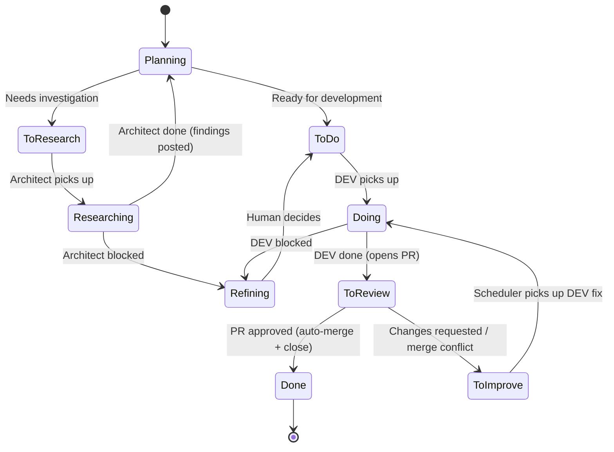

# DevClaw — Workflow Reference

The issue lifecycle in DevClaw is a configurable state machine defined in `workflow.yaml`. This document covers the default pipeline, all state types, review policies, and the optional test phase.

For config file format and location, see [Configuration](CONFIGURATION.md).

---

## Default Pipeline

```
Planning → To Do → Doing → To Review → PR approved → Done (auto-merge + close)
```

Human review, no test phase. Approved PRs are auto-merged and the issue is closed.



---

## Workflow States

Each state has a type, label, color, and optional transitions. The default configuration:

```yaml
workflow:
  initial: planning
  reviewPolicy: human
  states:
    planning:
      type: hold
      label: Planning
      color: "#95a5a6"
      on:
        APPROVE: todo
    toResearch:
      type: queue
      role: architect
      label: To Research
      color: "#0075ca"
      priority: 1
      on:
        PICKUP: researching
    researching:
      type: active
      role: architect
      label: Researching
      color: "#4a90e2"
      on:
        COMPLETE: planning
        BLOCKED: refining
    todo:
      type: queue
      role: developer
      label: To Do
      color: "#428bca"
      priority: 1
      on:
        PICKUP: doing
    doing:
      type: active
      role: developer
      label: Doing
      color: "#f0ad4e"
      on:
        COMPLETE:
          target: toReview
          actions: [detectPr]
        BLOCKED: refining
    toReview:
      type: queue
      role: reviewer
      label: To Review
      color: "#7057ff"
      priority: 2
      check: prApproved
      on:
        PICKUP: reviewing
        APPROVED:
          target: done
          actions: [mergePr, gitPull, closeIssue]
        MERGE_FAILED: toImprove
        CHANGES_REQUESTED: toImprove
        MERGE_CONFLICT: toImprove
    reviewing:
      type: active
      role: reviewer
      label: Reviewing
      color: "#c5def5"
      on:
        APPROVE:
          target: done
          actions: [mergePr, gitPull, closeIssue]
        REJECT: toImprove
        BLOCKED: refining
    done:
      type: terminal
      label: Done
      color: "#5cb85c"
    toImprove:
      type: queue
      role: developer
      label: To Improve
      color: "#d9534f"
      priority: 3
      on:
        PICKUP: doing
    refining:
      type: hold
      label: Refining
      color: "#f39c12"
      on:
        APPROVE: todo
```

The architect role has dedicated `To Research` and `Researching` states. Design tasks are triggered via the `research_task` tool, which creates an issue and transitions it through `To Research` → `Researching`. The architect posts findings as comments, creates implementation tasks in Planning, and completes with `work_finish`.

### State Types

| Type | Description |
|---|---|
| `queue` | Waiting for pickup. Must have a `role`. Has `priority` for ordering. Can have a `check` field (e.g. `prApproved`) — heartbeat polls and auto-transitions. |
| `active` | Worker is currently working on it. Must have a `role`. |
| `hold` | Paused, awaiting human decision. |
| `terminal` | Completed. No outgoing transitions. |

### Built-in Actions

| Action | Description |
|---|---|
| `gitPull` | Pull latest from the base branch |
| `detectPr` | Auto-detect PR URL from the issue |
| `mergePr` | Merge the PR associated with the issue. Critical in review states (aborts on failure). |
| `closeIssue` | Close the issue |
| `reopenIssue` | Reopen the issue |

### Review Checks

| Check | Description |
|---|---|
| `prMerged` | Transition when the issue's PR is merged |
| `prApproved` | Transition when the issue's PR is approved or merged |

### Priority Order

Queue states are processed in priority order during each heartbeat tick:

1. **To Improve** (priority 3) — fix requests from review
2. **To Review** (priority 2) — completed work awaiting review
3. **To Do** (priority 1) — new work

Higher priority number = picked up first.

---

## Review Policy

The `reviewPolicy` field controls how PRs are reviewed after a developer completes work:

```yaml
workflow:
  reviewPolicy: human  # Options: human, agent, auto
```

| Policy | Behavior |
|---|---|
| `human` (default) | All PRs need human approval on GitHub/GitLab. The heartbeat service auto-merges when the PR is approved. PR comments or changes-requested reviews automatically move the issue to "To Improve". |
| `agent` | An agent reviewer checks every PR before merge. The reviewer agent is dispatched automatically and calls `work_finish` with approve/reject. |
| `auto` | Junior/medior developer tasks → agent review. Senior developer tasks → human review. Useful for catching obvious issues with AI while reserving human review for complex work. |

### Per-Issue Overrides

Override the project-level policy for a single issue using labels:

| Label | Effect |
|---|---|
| `review:human` | Force human review |
| `review:agent` | Force agent review |
| `review:skip` | Skip review entirely |

**Source:** [`lib/workflow/queries.ts`](../lib/workflow/queries.ts) — `resolveReviewRouting()`

---

## Test Phase (optional)

By default, approved PRs go straight to Done. To add automated QA after review, enable the test phase by adding `toTest` and `testing` states.

### Enabling the Test Phase

**Step 1:** Add the `toTest` and `testing` states to your `workflow.yaml` (uncomment them in the generated file):

```yaml
    toTest:
      type: queue
      role: tester
      label: To Test
      color: "#5bc0de"
      priority: 2
      on:
        PICKUP: testing
    testing:
      type: active
      role: tester
      label: Testing
      color: "#9b59b6"
      on:
        PASS:
          target: done
          actions:
            - closeIssue
        FAIL:
          target: toImprove
          actions:
            - reopenIssue
        REFINE: refining
        BLOCKED: refining
```

**Step 2:** Change review targets from `done` to `toTest`:

```yaml
    toReview:
      on:
        APPROVED:
          target: toTest        # was: done
          actions: [mergePr, gitPull]  # removed: closeIssue
    reviewing:
      on:
        APPROVE:
          target: toTest        # was: done
          actions: [mergePr, gitPull]  # removed: closeIssue
```

**Step 3:** Add tester role prompts:

- Default: `devclaw/prompts/tester.md`
- Per-project: `devclaw/projects/<project>/prompts/tester.md`

**Per-issue skip:** Add the `test:skip` label to bypass testing for a specific issue.

### Pipeline with Test Phase

```
Planning → To Do → Doing → To Review → PR approved → To Test → Testing → Done
```

### Tester Completion Results

| Result | Transition | Meaning |
|---|---|---|
| `pass` | Testing → Done | Approved. Issue closed. |
| `fail` | Testing → To Improve | Issues found. Issue reopened, sent back to developer. |
| `refine` | Testing → Refining | Needs human decision. Pipeline pauses. |
| `blocked` | Testing → Refining | Cannot complete (env issues, etc.). Awaits human decision. |

### Test Review Process

When the test phase is enabled, tester workers follow a structured review process:

**1. Review the Code**

- Pull latest from the base branch
- Run tests and linting
- Verify changes address issue requirements
- Check for regressions in related functionality

**2. Document the Review (required)**

Before completing, the tester MUST create a review comment using `task_comment`:

```javascript
task_comment({
  projectGroupId: "<group-id>",
  issueId: <issue-number>,
  body: "## Test Review\n\n**Tested:**\n- [List what you tested]\n\n**Results:**\n- [Pass/fail details]\n\n**Environment:**\n- [Test environment details]",
  authorRole: "tester"
})
```

**3. Complete the Task**

After posting the comment, call `work_finish`:

```javascript
work_finish({
  role: "tester",
  projectGroupId: "<group-id>",
  result: "pass",  // or "fail", "refine", "blocked"
  summary: "Brief summary of review outcome"
})
```

### Comment Templates

**Passing review:**

```markdown
## Test Review

**Tested:**
- Feature A: [specific test cases]
- Feature B: [specific test cases]
- Edge cases: [list]

**Results:** All tests passed. No regressions found.

**Environment:**
- Browser/Platform: [details]
- Version: [details]
- Test data: [if relevant]

**Notes:** [Optional observations or recommendations]
```

**Failing review:**

```markdown
## Test Review — Issues Found

**Tested:**
- [What you tested]

**Issues Found:**
1. [Issue description with steps to reproduce]
2. [Issue description with expected vs actual behavior]

**Environment:**
- [Test environment details]

**Severity:** [Critical/Major/Minor]
```

### Why Review Comments Are Required

1. **Audit Trail** — Every review decision is documented in the issue tracker
2. **Knowledge Sharing** — Future reviewers understand what was tested
3. **Quality Metrics** — Enables tracking of test coverage
4. **Debugging** — When issues arise later, we know what was checked
5. **Compliance** — Some projects require documented QA evidence

### Tester Prompt Configuration

Tester workers receive instructions via role prompt files:

- `devclaw/projects/<project>/prompts/tester.md` — project-specific
- `devclaw/prompts/tester.md` — default fallback

These prompts should instruct the tester to always call `task_comment` before `work_finish`, include specific details about what was tested, and document results and environment.

---

## Customizing the Workflow

### Adding or Modifying States

Edit `workflow.yaml` (workspace-level or per-project). Each state needs:

- `type` — one of `queue`, `active`, `hold`, `terminal`
- `label` — display name (used for issue labels)
- `color` — hex color for issue labels
- `on` — transition map: event name → target state (or `{ target, actions }`)

Queue states also need:
- `role` — which role picks up work
- `priority` — pickup order (higher = first)

### Validation

Config is validated at load time with Zod schemas. Integrity checks verify:

- All transition targets reference existing states
- Queue states have roles assigned
- Terminal states have no outgoing transitions
- Review checks reference valid check types

**Source:** [`lib/config/schema.ts`](../lib/config/schema.ts)

### The `workflow_guide` Tool

Call the `workflow_guide` tool for interactive documentation. It returns comprehensive `workflow.yaml` configuration documentation, marking every field as FIXED (enum), FREE-FORM, or extendable. Use the optional `topic` parameter to narrow to a specific section: `overview`, `states`, `roles`, `review`, `testing`, `timeouts`, `overrides`.

---

## Related

- [Configuration](CONFIGURATION.md) — Config file format, roles, timeouts, `openclaw.json`
- [Tools Reference](TOOLS.md) — All 23 tools including `task_start`, `work_finish`, `task_list`, `workflow_guide`
- [Architecture](ARCHITECTURE.md) — System design, session model, heartbeat internals
